# Easy Bash

Easy Bash - a simple bash library to make scripting easier.

# How to use it

Here is a step by step example to illustrate how easybash makes scripting easier.

## Create your script

You can simply clone examples/template.sh.

```
git clone git@github.com:DBADaily/easybash.git
cd easybash
mkdir echo_dates
cp -a examples/template.sh echo_dates/echo_dates.sh
cd echo_dates/
vi echo_dates.sh
```

### Step 1 - add your options as below

```
add_main_options() {
  ## custom options
  # add your options here
  add_options "s:" "start-date:" "START_DATE" "Y" "start date"
  add_options "e:" "end-date:" "END_DATE" "Y" "end date"
  ...
}
```

### Step 2 - write your custom function

```
# custom function
echo_dates() {
  local lv_start_date="$1"
  local lv_end_date="$2"
  while [[ "${lv_start_date}" -le "${lv_end_date}" ]]; do
    echo_blue_bold "Processing for date ${lv_start_date}"
    log_trace "Work for date ${lv_start_date} done."
    lv_start_date=$(date -d "${lv_start_date} + 1 days" +'%Y%m%d')
  done
}
```

### Step 3 - implement main function

```
main() {
  add_main_options
  parse_args "$@"

  # add your logic here
  if [[ "$CHECK_MODE" != "Y" ]]; then
    echo_dates "${START_DATE}" "${END_DATE}"
  elif [[ "$CHECK_MODE" == "Y" ]]; then
    log_warning "CHECK MODE. Skip echoing dates."
  fi
}
```

Here are the complete codes:

```
#!/usr/bin/env bash
################################################################################
#
# Author: Alvin
# License: MIT
# GitHub: https://github.com/dbadaily/easybash
#
# echo dates
################################################################################

VERSION_STR="1.0.0"

current_dir="$(dirname "$(readlink -f "${BASH_SOURCE[0]}")")"

lib_dir="$(dirname "${current_dir}")"

source "${lib_dir}/lib/easybash.sh"

add_main_options() {
  ## custom options
  # add your options here
  add_options "s:" "start-date:" "START_DATE" "Y" "start date"
  add_options "e:" "end-date:" "END_DATE" "Y" "end date"

  ## common options
  # 1. options like m: or emails: can be changed
  # 2. variable names like RECIPIENTS are NOT expected to be changed as they are used in libraries
  add_options "m:" "email:" "RECIPIENTS" "N" "emails(separated by space) to receive notifications"
  add_options "S" "success-notification" "SUCCESS_NOTIFICATION_IND" "N" "indication whether to send success notifications"
  add_options "C" "check" "CHECK_MODE" "N" "don't make any changes"
  add_options "G" "generate-config" "GEN_CONFIG" "N" "generate config file if not exists"
  add_options "w" "write-values" "WRITE_VALUES" "N" "used together with -G, write values provided by command options to config file"
  add_options "H" "help" "HELP" "N" "show this help"
  add_options "V" "version" "VERSION" "N" "output version information"
  add_options "v" "verbose" "VERBOSE" "N" "verbose mode"
}

# custom function
echo_dates() {
  local lv_start_date="$1"
  local lv_end_date="$2"
  while [[ "${lv_start_date}" -le "${lv_end_date}" ]]; do
    echo_blue_bold "Processing for date ${lv_start_date}"
    log_trace "Work for date ${lv_start_date} done."
    lv_start_date=$(date -d "${lv_start_date} + 1 days" +'%Y%m%d')
  done
}

main() {
  add_main_options
  parse_args "$@"

  # add your logic here
  if [[ "$CHECK_MODE" != "Y" ]]; then
    echo_dates "${START_DATE}" "${END_DATE}"
  elif [[ "$CHECK_MODE" == "Y" ]]; then
    log_warning "CHECK MODE. Skip echoing dates."
  fi
}

main "$@"
```

## Run your script

### Show help message

Show help message to get information about options.

```
bash echo_dates.sh -H
```

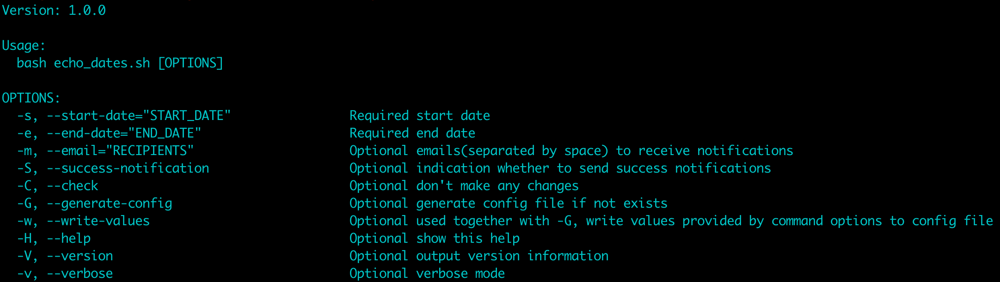

### Run with parameters

```
bash echo_dates.sh -s 20220101 -e 20220107
```

Result:


### Run in verbose mode

Run in verbose mode to debug or get more detailed information, e.g. LOG_FILE.

```
bash echo_dates.sh -s 20220101 -e 20220107 -v
```

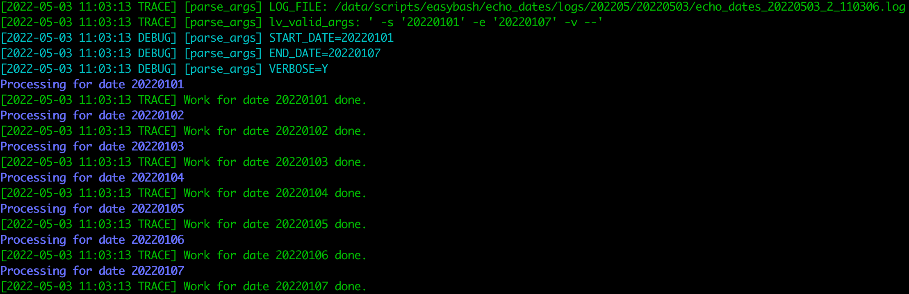

### Run in check mode

Run in check mode so that you can double check before you run it actually.

```
bash echo_dates.sh -s 20220101 -e 20220107 -v -C
```

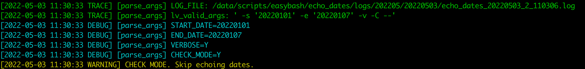

### Run without all required parameters

Better run in check mode so that it makes no changes.

Run with no parameters, it will:

1. give warning hints about all required options
2. give a fatal message
3. exit after the fatal message

```
bash echo_dates.sh -v -C
```

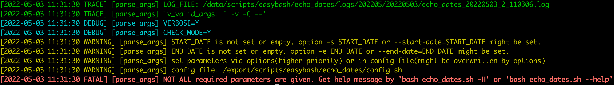

Run with one parameter.

```
bash echo_dates.sh -s 20220101 -v -C
```

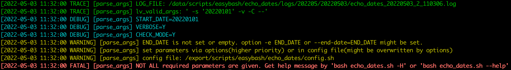

### Generate config file

You can also store your parameters in a config file.

Write the config file yourself ?

Just use `-G` option to generate a config file for you.

```
bash echo_dates.sh -s 20220101 -e 20220107 -v -G
```

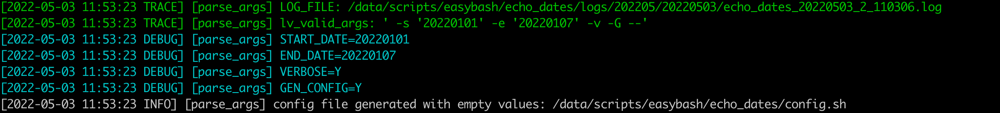

Check the contents of the config file.

```
cat config.sh
```

```
# start date
START_DATE=""

# end date
END_DATE=""

...
```

During development, you might add more options.

It will save the old config file once you generate again.

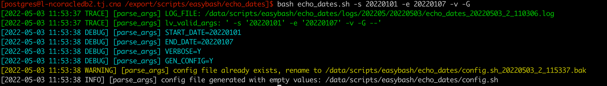

### Generate config file with values

Generating a config file with empty values is not enough, you need to set the values automatically.

Combine options `-G` and `-w` together, it will generate config file with parameters assigned.

```
bash echo_dates.sh -s 20220101 -e 20220107 -v -G -w
```

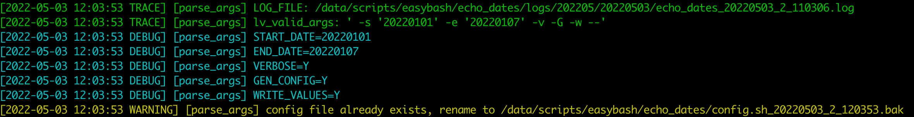

```
cat config.sh
```

```
# start date
START_DATE="20220101"

# end date
END_DATE="20220107"

...
```

### Run with config file

After having generated config file with variables assigned, you can run the script without parameters.

```
bash echo_dates.sh -v
```

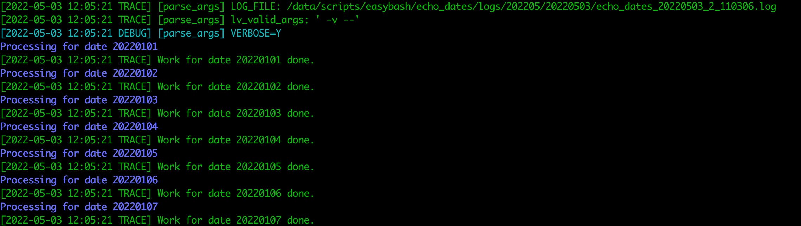

### Overwrite config file variables

Variables in config file will be overwritten by options.

```
bash echo_dates.sh -v -e 20220103
```

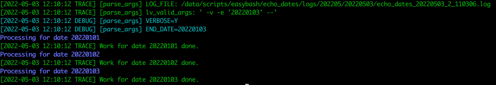

### Send messages

Add `send_msg` as below to send notification so that you are informed timely.

```
# custom function
echo_dates() {
  local lv_start_date="$1"
  local lv_end_date="$2"
  local lv_msg="Work between ${lv_start_date} and ${lv_end_date} is done."
  ...
  send_msg "${lv_msg}"
}
```

Email can be specified by `-m` .

```
bash echo_dates.sh -s 20220101 -e 20220107 -m "alvin@dbadaily.com"
```

# Easy Bash libraries

## Vars

Global variables useful or used by libraries are stored here.

Below shows some examples.

### Date and time vars

```
MONTH_STR: 202205
DATE_STR: 20220501
TIME_STR: 20220501_3_132939
```

### Script vars

```
SCRIPT_DIR: /data/scripts/easybash/test
SCRIPT_FULL_NAME: test_vars.sh
```

### logging vars

```
LOG_LEVEL: INFO
LOG_DIR: /data/scripts/easybash/test/logs/202205/20220501
LOG_FILE: /data/scripts/easybash/test/logs/202205/20220501/test_vars_20220501_3_132939.log
```

And logging color vars

```
export COLOR_TRACE="green"
export COLOR_DEBUG="cyan"
export COLOR_INFO="white"
export COLOR_WARN="yellow"
export COLOR_ERROR="red"
export COLOR_FATAL="red"
```

For more global variables, refer to `lib/lib_vars.sh`.

## Color

Test color example script.

```
bash examples/test_color.sh
```

Colors and corresponding numbers:

```
(["black"]="0" ["red"]="1" ["green"]="2" ["yellow"]="3" ["blue"]="4" ["magenta"]="5" ["cyan"]="6" ["white"]="7")
```

### echo with colors

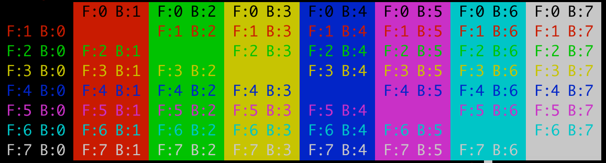

#### echo colors functions

```
echo_red "echo_red"
echo_red_bold "echo_red_bold"
echo_green "echo_green"
echo_green_bold "echo_green_bold"
echo_yellow "echo_yellow"
echo_yellow_bold "echo_yellow_bold"
echo_blue "echo_blue"
echo_blue_bold "echo_blue_bold"
echo_magenta "echo_magenta"
echo_magenta_bold "echo_magenta_bold"
echo_cyan "echo_cyan"
echo_cyan_bold "echo_cyan_bold"
echo_white "echo_white"
echo_white_bold "echo_white_bold"
```


Echo colors with background.

```
echo_blue "echo_blue: foreground - blue, no background." "" "bold"
echo_blue "echo_blue: foreground - blue, background: yellow." "yellow" "bold"
```


#### echo_color

`echo_color` is called by `echo_blue` etc..

```
echo_color "echo_color: foreground - green, no background." "green" "" "bold"
echo_color "echo_color: foreground - green, background - red." "green" "red" "bold"
```


#### echo_color_by_num

`echo_color_by_num` is called by `echo_color` .

```
echo_color_by_num "echo_color_by_num: foreground - red, no background." "1" "" "bold"
echo_color_by_num "echo_color_by_num: foreground - red, background - blue." "1" "4" "bold"
```


### Set colors

#### Set color for existing echos

```
set_color "green"
echo "set_color: foreground - green, no background."
echo "You can echo lines as usual."
echo "So that you can easilly set color for existing echos."
echo "Or set the same color for mulitple lines."
echo "reset_color"
reset_color
```


```
set_color "green" "" "bold"
echo "set_color foreground - green bold, no background."
echo "You can echo lines as usual."
echo "So that you can easilly set color for existing echos."
echo "Or set the same color for mulitple lines."
echo "reset_color"
reset_color
```


#### Set color with background in loop

```
declare -a la_str
la_str+=("set_color foreground - green, background - red.")
la_str+=("You can echo lines as usual.")
la_str+=("So that you can easilly set color for existing echos.")
la_str+=("Or set the same color for mulitple lines.")
la_str+=("reset_color")
for str_value in "${la_str[@]}"; do
  set_color "green" "red"
  echo "${str_value}${COLOR_RESET}"
done
```


## Logging

Test logging example script.

```
bash examples/test_logging.sh -v
```

```
log_trace "This is a trace message."
log_debug "This is a debug message."
log_info "This is a info message."
log_warning "This is a warning message."
log_error "This is a warning message."
log_fatal "This is a fatal message."
```


## Parse

Take following script for example.

```
cd easybash/echo_dates
cat echo_dates.sh
```

```
#!/usr/bin/env bash
################################################################################
#
# Author: Alvin
# License: MIT
# GitHub: https://github.com/dbadaily/easybash
#
# echo dates
################################################################################

VERSION_STR="1.0.0"

current_dir="$(dirname "$(readlink -f "${BASH_SOURCE[0]}")")"

lib_dir="$(dirname "${current_dir}")"

source "${lib_dir}/lib/easybash.sh"

add_main_options() {
  ## custom options
  # add your options here
  add_options "s:" "start-date:" "START_DATE" "Y" "start date"
  add_options "e:" "end-date:" "END_DATE" "Y" "end date"

  ## common options
  # 1. options like m: or emails: can be changed
  # 2. variable names like RECIPIENTS are NOT expected to be changed as they are used in libraries
  add_options "m:" "email:" "RECIPIENTS" "N" "emails(separated by space) to receive notifications"
  add_options "S" "success-notification" "SUCCESS_NOTIFICATION_IND" "N" "indication whether to send success notifications"
  add_options "C" "check" "CHECK_MODE" "N" "don't make any changes"
  add_options "G" "generate-config" "GEN_CONFIG" "N" "generate config file if not exists"
  add_options "w" "write-values" "WRITE_VALUES" "N" "used together with -G, write values provided by command options to config file"
  add_options "H" "help" "HELP" "N" "show this help"
  add_options "V" "version" "VERSION" "N" "output version information"
  add_options "v" "verbose" "VERBOSE" "N" "verbose mode"
}

# custom function
echo_dates() {
  local lv_start_date="$1"
  local lv_end_date="$2"
  local lv_msg="Work between ${lv_start_date} and ${lv_end_date} is done."
  while [[ "${lv_start_date}" -le "${lv_end_date}" ]]; do
    echo_blue_bold "Processing for date ${lv_start_date}"
    log_trace "Work for date ${lv_start_date} done."
    lv_start_date=$(date -d "${lv_start_date} + 1 days" +'%Y%m%d')
  done
  send_msg "${lv_msg}"
}

main() {
  add_main_options
  parse_args "$@"

  # add your logic here
  if [[ "$CHECK_MODE" != "Y" ]]; then
    echo_dates "${START_DATE}" "${END_DATE}"
  elif [[ "$CHECK_MODE" == "Y" ]]; then
    log_warning "CHECK MODE. Skip echoing dates."
  fi
}

main "$@"
```

### Easy way to add options

Options can be added as below.

```
add_main_options() {
  ## custom options
  # add your options here
  add_options "s:" "start-date:" "START_DATE" "Y" "start date"
  ...
}
```

1. The short option is `s:` 
2. The long option is `start-date:`

3. It will create global variable `START_DATE` and assign command line option value to it

4. `"Y"` indicates it is a required parameter

5. `"start date"` is the option comment

### Automatic parsing and assignment

Parsing and variable assignment can be done easily using only one line code:

```
parse_args "$@"
```

All options will be automatically parsed by `getopt`. 

```
# bash echo_dates.sh -s
getopt: option requires an argument -- 's'
# bash echo_dates.sh -f
getopt: invalid option -- 'f'
```

It will create global variables for every option.

And assignments are done automatically, so that you can reference them easily.

```
bash echo_dates.sh -s 20220101 -e 20220107 -v
```

```
[2022-05-01 08:30:01 TRACE] [parse_args] lv_valid_args: ' -s '20220101' -e '20220107' -v --'
[2022-05-01 08:30:01 DEBUG] [parse_args] START_DATE=20220101
[2022-05-01 08:30:01 DEBUG] [parse_args] END_DATE=20220107
[2022-05-01 08:30:01 DEBUG] [parse_args] VERBOSE=Y
```

### Mixed short and long options

You can use mixed short and long options.

```
bash echo_dates.sh --start-date 20220101 -e 20220107 -v
```

### Generate help message automatically

It will generate help message automatically based on the options and comments added.

```
bash echo_dates.sh -H
```


### Built-in options

Common options are suggested to be added to utilize various functionalaties which will be introduced further more.

For the common options,

1. You can change both short or long option names, e.g. `m:` or `emails:` can be changed
2. All common variable names are used in easybash libraries and their names are NOT expected to be changed unless you update all referrenced variables accordingly.

```
add_main_options() {
  ## custom options
  # add your options here
  ...

  ## common options
  # 1. options like m: or emails: can be changed
  # 2. variable names like RECIPIENTS are NOT expected to be changed as they are used in libraries
  add_options "m:" "email:" "RECIPIENTS" "N" "emails(separated by space) to receive notifications"
  add_options "S" "success-notification" "SUCCESS_NOTIFICATION_IND" "N" "indication whether to send success notifications"
  add_options "C" "check" "CHECK_MODE" "N" "don't make any changes"
  add_options "G" "generate-config" "GEN_CONFIG" "N" "generate config file if not exists"
  add_options "w" "write-values" "WRITE_VALUES" "N" "used together with -G, write values provided by command options to config file"
  add_options "H" "help" "HELP" "N" "show this help"
  add_options "V" "version" "VERSION" "N" "output version information"
  add_options "v" "verbose" "VERBOSE" "N" "verbose mode"
}
```

### Run in verbose mode

By default, the `LOG_LEVEL` is `INFO`.

You can always add option `-v` to reset `LOG_LEVEL` to `TRACE` to debug or get more detailed information.

```
bash echo_dates.sh -s 20220101 -e 20220107 -v
```


### Run in check mode

`-C` is a super helpful option borrowed from ansible to indicate check mode or dry run mode.

You are encouraged to implement check logic in your codes and always run in check mode first so that you can double check to avoid unnecessary incidents. 

```
if [[ "$CHECK_MODE" != "Y" ]]; then
  echo_dates "${START_DATE}" "${END_DATE}"
elif [[ "$CHECK_MODE" == "Y" ]]; then
  log_warning "CHECK MODE. Skip echoing dates."
fi
```

```
bash echo_dates.sh -s 20220101 -e 20220107 -v -C
```


### Check required parameters

`getopt` doesn't provide a way to check whether one option is required or not.

Yet it is helpful to check mandatory parameters first.

Parameter `"Y"` below indicates it is a required parameter.

```
add_options "s:" "start-date:" "START_DATE" "Y" "start date"
```

Better run in check mode so that it makes no changes.

Run without all required options, it will:

1. give warning hints about all remaining required options
2. give a fatal message
3. exit after the fatal message

```
bash echo_dates.sh -v -C
```


Run with one parameter.

```
bash echo_dates.sh -s 20220101 -v -C
```


### Generate config file

When there are too many parameters, it might be better to use a config file.

Write the config file yourself ?

Just use `-G` option to generate a config file for you based on the options specified.

By default, a config file named `config.sh`  will be created in the same folder as the script.

And the config file will be sourced if it exists.

```
bash echo_dates.sh -s 20220101 -e 20220107 -v -G
```


Check the contents of the config file.

```
cat config.sh
```

```
# start date
START_DATE=""

# end date
END_DATE=""

...
```

During development, you might add more options.

It will save the old config file once you generate again.


### Generate config file with values

Generating a config file with empty values is not enough, you need to set the values automatically.

Combine options `-G` and `-w` together, it will generate config file with parameters assigned.

```
bash echo_dates.sh -s 20220101 -e 20220107 -v -G -w
```


```
cat config.sh
```

```
# start date
START_DATE="20220101"

# end date
END_DATE="20220107"

...
```

After having generated config file with variables assigned, you can run the script without parameters.

```
bash echo_dates.sh -v
```


### Overwrite config file variables

While all the variables are stored in a config file, you might need to update one or more variables in some scenarios. 

You can also pass some parameters via options. Variables in config file will be overwritten by options.

```
bash echo_dates.sh -v -e 20220103
```


## Notification

You can send messages using `send_msg` as below to send notification so that you are informed timely.

It would be very helpful if you need to keep an eye on the process of the script running.

Send only a message or subject of email:

```
send_msg "${lv_subject}"
```

Send a message and details:

```
send_msg "${lv_subject}" "${lv_body}"
```

Email can be specified by `-m` .

```
bash echo_dates.sh -s 20220101 -e 20220107 -m "alvin@dbadaily.com"
```

If `RECIPIENTS` is not provided via options nor config file, there will a warning message and no messages will be sent.

```
[2022-05-01 11:35:25 WARNING] RECIPIENTS is not set or empty. option -m RECIPIENTS or --email=RECIPIENTS might be set.
```

`send_msg` is prefered over `send_email` .

The former easily enables to turn to other efficient ways of notification, e.g. IM.

As you can see below, `send_msg` calls `send_email` which might be overwritten.

```
send_email() {
  ...
    echo "${lv_body}" | mail -s "${lv_subject}" "${lv_recipient}"
  ...
}

send_msg() {
  ...
    send_email "${RECIPIENTS}" "${lv_subject}" "${lv_body}"
  ...
}
```

## Date

Date range is helpful in scenarios like:

1. You need to delete data of some date range
2. You need to dump or achive data of some date range

And there are several ways to specify data range.

1. By start date and end date
2. By month
3. By start date and days

With `set_dates_by_args`, you can easily set `START_DATE` and `END_DATE` for all above three cases.

To get all the days between `START_DATE` and `END_DATE` , there are also three ways:

1. `get_dates` by `START_DATE` and `END_DATE` 

```
lv_dates="$(get_dates ""${START_DATE}" " "${END_DATE}")"
print_dates "${lv_dates}"
```

2. `get_dates_by_args` which internally use `START_DATE` and `END_DATE` 

```
lv_dates="$(get_dates_by_args)"
print_dates "${lv_dates}"
```

3. `loop_dates` by `START_DATE` and `END_DATE` 

```
loop_dates "${START_DATE}" "${END_DATE}"
```

Test date example script codes:

```
cat examples/test_date.sh
```

```
main() {
  add_main_options
  parse_args "$@"

  local lv_dates=""
  set_dates_by_args

  log_trace "calling get_dates with parameters START_DATE and END_DATE"
  lv_dates="$(get_dates "${START_DATE}" "${END_DATE}")"
  print_dates "${lv_dates}"

  log_trace "calling get_dates_by_args without parameters"
  lv_dates="$(get_dates_by_args)"
  print_dates "${lv_dates}"

  log_trace "calling loop_dates with parameter START_DATE and END_DATE"
  loop_dates "${START_DATE}" "${END_DATE}"
}
```

Test date examples.

### Get dates by start date and end date

```
bash examples/test_date.sh -s 20220101 -e 20220103 -v
```

```
[2022-05-01 08:01:20 DEBUG] [parse_args] START_DATE=20220101
[2022-05-01 08:01:20 DEBUG] [parse_args] END_DATE=20220103
[2022-05-01 08:01:20 DEBUG] [parse_args] VERBOSE=Y
[2022-05-01 08:01:20 TRACE] calling get_dates with parameters START_DATE and END_DATE
[2022-05-01 08:01:20 INFO] lv_date=20220101
[2022-05-01 08:01:20 INFO] lv_date=20220102
[2022-05-01 08:01:20 INFO] lv_date=20220103
[2022-05-01 08:01:20 TRACE] calling get_dates_by_args without parameters
[2022-05-01 08:01:20 INFO] lv_date=20220101
[2022-05-01 08:01:20 INFO] lv_date=20220102
[2022-05-01 08:01:20 INFO] lv_date=20220103
[2022-05-01 08:01:20 TRACE] calling loop_dates with parameter START_DATE and END_DATE
[2022-05-01 08:01:20 INFO] lv_start_date=20220101
[2022-05-01 08:01:20 INFO] lv_start_date=20220102
[2022-05-01 08:01:20 INFO] lv_start_date=20220103
```

### Get dates by month

```
bash examples/test_date.sh -M 202201 -v
```

### Get dates by start date and days

```
bash examples/test_date.sh -s 20220101 -d 3 -v
```

# Conclusion

easybash enables you write simple, efficient and colorful scripts easily.

You no longer need to:

1. parse all the arguments manually
2. set variables manually
3. write help message manually
4. write config file manually
5. check manually whether all required parameters are set
6. write logs manually

And you are able to do the following easily:

1. add options easily
2. parse options easily
3. do dry run test easily
4. write colorful logs easily
5. write and show different levels of logs easily
6. send messages easily

