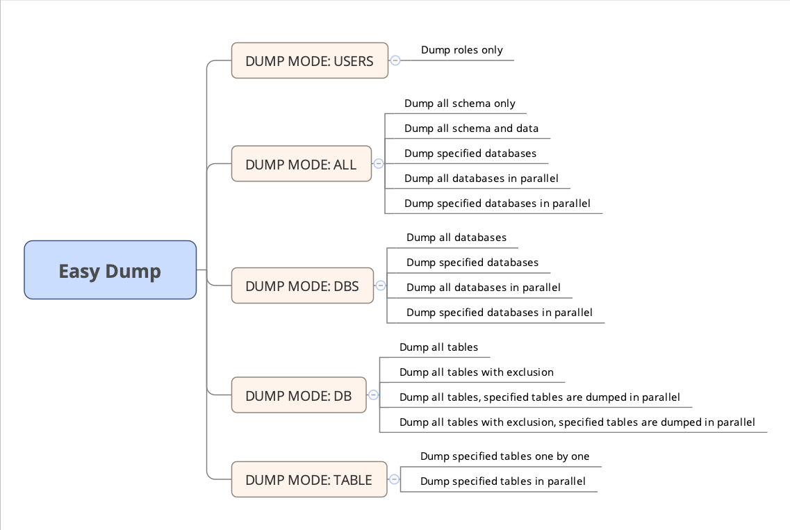
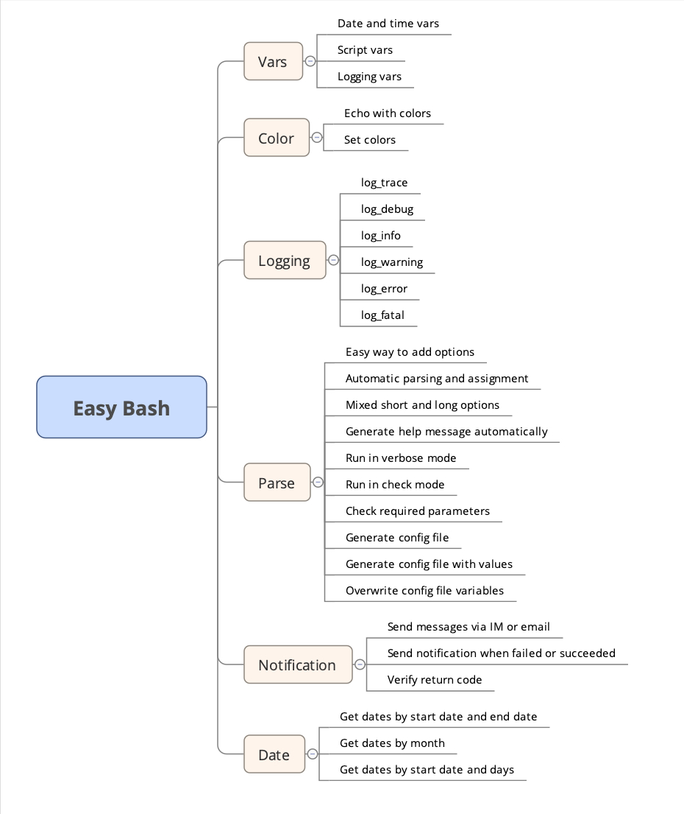

# Easy Dump


While you are upgrading from PostgreSQL earlier releases like PostgreSQL 9.1 to later releases like PostgreSQL 11, pg_dump and pg_upgrade provided by PostgreSQL are the most reliable and most powerful tools.

pg_dump is more flexible and can also be used to dump some of databases or tables to another instance.

Easy Dump is a simple shell script to make PostgreSQL pg_dump easier.

With Easy Dump, you are able to dump databases or tables into another PostgreSQL instance easily in one command line. 

Apart from the dump functionality, Easy Dump also sends successful notifications and checks errors when dump or restore failed and sends failure notifications with details in cases like invalid password is given or no proper ACL is given, so that you are informed timely with helpful information.

# Easy Dump introduction

## Easy Dump Overview

Easy Dump is written with library [Easy Bash](https://github.com/dbadaily/easybash) and provides 5 dump modes to support 16 most useful cases.



## Why use Easy Bash


Easy Bash is a simple bash library to make scripting easier.

With Easy Bash, you are able to parse command line parameters with only one line(15 characters):

```
parse_args "$@"
```

In fact, there is much more Easy Bash can do.

Easy Bash helps you write simple, efficient and colorful scripts easily.

You no longer need to do the following manually:

1. parse all the arguments manually
2. set variables manually
3. write help message manually
4. write config file manually
5. check whether all required parameters are set manually
6. write logs manually

And you are able to do the following easily:

1. add options easily
2. parse options easily
3. do dry run test easily
4. write colorful logs easily
5. write and show different levels of logs easily
6. send messages easily

## Easy Bash Overview

Here is an overview of the functionalities of Easy Bash.



# Example data

## Source PostgreSQL instance

Host: alvindb1.dbadaily.com

Port: 5432

PostgreSQL version: PostgreSQL 9.1

To illustrate the usage of Easy Dump, on the source PostgreSQL instance, create one user and three databases including tables.

### Create user

```
CREATE USER alvin WITH PASSWORD 'alvin';
```

### Create databases and tables

#### Database alvindb

Create database alvindb and schema alvin.

```
CREATE DATABASE alvindb OWNER alvin;
\c alvindb
CREATE SCHEMA alvin AUTHORIZATION alvin;
```

Create tables.

```
\c alvindb alvin
CREATE TABLE tb_alvindb_vacuum (
    test_id BIGSERIAL PRIMARY KEY,
    test_num BIGINT
);

CREATE TABLE tb_alvindb_sequence (
    test_id SERIAL PRIMARY KEY,
    test_num BIGINT
);

CREATE TABLE tb_alvindb_test (
    test_id SERIAL PRIMARY KEY,
    test_num BIGINT
);

INSERT INTO tb_alvindb_vacuum(test_num) SELECT gid FROM generate_series(1,3,1) gid;
INSERT INTO tb_alvindb_sequence(test_num) SELECT gid FROM generate_series(1,3,1) gid;
INSERT INTO tb_alvindb_test(test_num) SELECT gid FROM generate_series(1,3,1) gid;
```

#### Database dbadaily

Create database dbadaily.

```
CREATE DATABASE dbadaily OWNER alvin;
```

Create tables.

```
\c dbadaily alvin

CREATE TABLE tb_dbadaily_vacuum (
    test_id BIGSERIAL PRIMARY KEY,
    test_num BIGINT
);

CREATE TABLE tb_dbadaily_sequence (
    test_id SERIAL PRIMARY KEY,
    test_num BIGINT
);

CREATE TABLE tb_dbadaily_test (
    test_id SERIAL PRIMARY KEY,
    test_num BIGINT
);

INSERT INTO tb_dbadaily_vacuum(test_num) SELECT gid FROM generate_series(1,3,1) gid;
INSERT INTO tb_dbadaily_sequence(test_num) SELECT gid FROM generate_series(1,3,1) gid;
INSERT INTO tb_dbadaily_test(test_num) SELECT gid FROM generate_series(1,3,1) gid;
```

#### Database testdb

Create database testdb.

```
CREATE DATABASE testdb OWNER alvin;
```

Create tables.

```
\c testdb alvin

CREATE TABLE tb_testdb_vacuum (
    test_id BIGSERIAL PRIMARY KEY,
    test_num BIGINT
);

CREATE TABLE tb_testdb_sequence (
    test_id SERIAL PRIMARY KEY,
    test_num BIGINT
);

CREATE TABLE tb_testdb_test (
    test_id SERIAL PRIMARY KEY,
    test_num BIGINT
);

INSERT INTO tb_testdb_vacuum(test_num) SELECT gid FROM generate_series(1,3,1) gid;
INSERT INTO tb_testdb_sequence(test_num) SELECT gid FROM generate_series(1,3,1) gid;
INSERT INTO tb_testdb_test(test_num) SELECT gid FROM generate_series(1,3,1) gid;
```

## Target PostgreSQL instance

Host: alvindb2.dbadaily.com

Port: 5432

PostgreSQL version: PostgreSQL 11

# Dump options

Pure shell library Easy Bash provides an easy way to add and parse options.

Add options as below.

```
add_main_options() {
  ## custom options
  # source db
  add_options "h:" "host:" "DBHOST" "Y" "source database server host or socket directory"
  add_options "p:" "port:" "DBPORT" "Y" "source database server port number"
  add_options "U:" "username:" "DBUSER" "Y" "source database user name"
  add_options "W:" "password:" "PGPASSWORD" "Y" "source database user password"
  add_options "d:" "dbname:" "DBNAME" "N" "source database name to connect to"

  # target db
  add_options "P:" "target-port:" "DBPORT_TARGET" "Y" "target database server port number"
  add_options "B:" "bin-dir:" "PGBIN" "Y" "PostgreSQL bin directory"

  # dump modes
  add_options "M:" "mode:" "DUMP_MODE" "Y" "dump modes: ALL USERS DBS DB TABLE"
  # ALL mode
  add_options "s" "schema-only" "SCHEMA_ONLY" "N" "SCHEMA mode: dump only the schema, no data"
  # ALL or DBS mode
  add_options "D:" "databases:" "DATABASES" "N" "ALL mode: databases(separated by space) to dump"
  # DB or TABLE mode
  add_options "T:" "tables:" "DBTABLES" "N" "tables(separated by space) to dump. DB mode: dump tables in parallel; TABLE mode: tables to dump"
  # DB mode
  add_options "E:" "excludetables:" "DBTABLES_EXCLUDE" "N" "tables to exclude"

  # other options
  add_options "u" "users" "DUMP_ALL_USERS" "N" "dump all users regardless of dump mode"
  add_options "L" "parallel" "PARALLEL_IND" "N" "parallel indicator"
  add_options "t:" "sleep-time:" "SLEEP_TIME" "N" "time to sleep between dumps"

  ### common options
  ## 1. options like m: or emails: can be changed
  ## 2. variable names like RECIPIENTS are NOT expected to be changed as they are used in shared functions
  add_options "m:" "email:" "RECIPIENTS" "N" "emails(separated by space) to receive notifications"
  add_options "S" "success-notification" "SUCCESS_NOTIFICATION_IND" "N" "indication whether to send success notifications"
  add_options "C" "check" "CHECK_MODE" "N" "don't make any changes"
  add_options "G" "generate-config" "GEN_CONFIG" "N" "generate config file if not exists"
  add_options "w" "write-values" "WRITE_VALUES" "N" "used together with -G, write values provided by command options to config file"
  add_options "H" "help" "HELP" "N" "show this help"
  add_options "V" "version" "VERSION" "N" "output version information"
  add_options "v" "verbose" "VERBOSE" "N" "verbose mode"
}
```

Library Easy Bash provides a handy way to generate help message automatically based on the options and comments above.

```
$ bash pg_dump.sh -H
Version: 1.0.0

Usage:
  bash pg_dump.sh [OPTIONS]

OPTIONS:
  -h, --host="DBHOST"                          Required source database server host or socket directory
  -p, --port="DBPORT"                          Required source database server port number
  -U, --username="DBUSER"                      Required source database user name
  -W, --password="PGPASSWORD"                  Required source database user password
  -d, --dbname="DBNAME"                        Optional source database name to connect to
  -P, --target-port="DBPORT_TARGET"            Required target database server port number
  -B, --bin-dir="PGBIN"                        Required PostgreSQL bin directory
  -M, --mode="DUMP_MODE"                       Required dump modes: ALL USERS DBS DB TABLE
  -s, --schema-only                            Optional SCHEMA mode: dump only the schema, no data
  -D, --databases="DATABASES"                  Optional ALL mode: databases(separated by space) to dump
  -T, --tables="DBTABLES"                      Optional tables(separated by space) to dump. DB mode: dump tables in parallel; TABLE mode: tables to dump
  -E, --excludetables="DBTABLES_EXCLUDE"       Optional tables to exclude
  -u, --users                                  Optional dump all users regardless of dump mode
  -L, --parallel                               Optional parallel indicator
  -t, --sleep-time="SLEEP_TIME"                Optional time to sleep between dumps
  -m, --email="RECIPIENTS"                     Optional emails(separated by space) to receive notifications
  -S, --success-notification                   Optional indication whether to send success notifications
  -C, --check                                  Optional don't make any changes
  -G, --generate-config                        Optional generate config file if not exists
  -w, --write-values                           Optional used together with -G, write values provided by command options to config file
  -H, --help                                   Optional show this help
  -V, --version                                Optional output version information
  -v, --verbose                                Optional verbose mode
```

# Generate config file

Using Easy Bash built-in options `-G` and `-w` to generate a config file and write static variables into the config file, so that only a few options need to be provided by command line.

```
bash pg_dump.sh -h alvindb1.dbadaily.com -p 5432 -U postgres -P 5432 -B "/usr/pg11/bin/" -m "alvin@dbadaily.com" -W postgres -S -G -w
```

```
[2022-05-15 20:54:09 INFO] [parse_args] config file generated with values: /data/scripts/easybash/easydump/config.sh
```

After config file generated,  command

```
bash pg_dump.sh -v -M USERS
```

is equivalent to

```
bash pg_dump.sh -h alvindb1.dbadaily.com -p 5432 -U postgres -P 5432 -B "/usr/pg11/bin/" -m "alvin@dbadaily.com" -W postgres -S -v -M USERS
```

Check the config file.

```
$ cat /data/scripts/easybash/easydump/config.sh
# source database server host or socket directory
export DBHOST="alvindb1.dbadaily.com"

# source database server port number
export DBPORT="5432"

# source database user name
export DBUSER="postgres"

# source database user password
export PGPASSWORD="postgres"

# source database name to connect to
export DBNAME=""

# target database server port number
export DBPORT_TARGET="5432"

# PostgreSQL bin directory
export PGBIN="/usr/pg11/bin/"

# dump modes: ALL USERS DBS DB TABLE
export DUMP_MODE=""

# SCHEMA mode: dump only the schema, no data
export SCHEMA_ONLY=""

# ALL mode: databases(separated by space) to dump
export DATABASES=""

# tables(separated by space) to dump. DB mode: dump tables in parallel; TABLE mode: tables to dump
export DBTABLES=""

# tables to exclude
export DBTABLES_EXCLUDE=""

# dump all users regardless of dump mode
export DUMP_ALL_USERS=""

# parallel indicator
export PARALLEL_IND=""

# time to sleep between dumps
export SLEEP_TIME=""

# emails(separated by space) to receive notifications
export RECIPIENTS="alvin@dbadaily.com"

# indication whether to send success notifications
export SUCCESS_NOTIFICATION_IND="Y"

# don't make any changes
export CHECK_MODE=""
```

# Dump modes

Following commands are expected to be run on the host where data will be dumped to.

Together with Easy Dump commands, PostgreSQL pg_dump equivalents are provided for reference and a better understanding.

While most frequently used cases are covered by Easy Dump, you might meet rare or custom cases. Refer to the PostgreSQL pg_dump equivalents to write your own commands.

## USERS

### Dump roles only

In some cases you might dump all users first, then add or remove or update user passwords as needed.

1.  If you are just separating one database from a huge instance on which there are multiple databases, you might need only users related
2.  Not all passwords are same between the old instance and the new instance, such as the replicator password

**PostgreSQL pg_dump command**

```
time "${PGBIN}"/pg_dumpall -v -U "${DBUSER}" -h "${DBHOST}" -p "${DBPORT}" -g 2>>"${lv_dump_log}" | "${PGBIN}"/psql -U postgres -p "${DBPORT_TARGET}" -e &>>"${lv_restore_log}"
```

**Easy Dump command**

```
bash pg_dump.sh -v -M USERS
```

```
[2022-05-15 21:02:36 TRACE] [parse_args] LOG_FILE: /data/scripts/easybash/easydump/logs/202205/20220515/pg_dump_20220515_2_210236.log
[2022-05-15 21:02:36 TRACE] [parse_args] lv_valid_args: ' -v -M 'USERS' --'
[2022-05-15 21:02:36 TRACE] [parse_args] config file found: /data/scripts/easybash/easydump/config.sh
[2022-05-15 21:02:36 DEBUG] [parse_args] VERBOSE=Y
[2022-05-15 21:02:36 DEBUG] [parse_args] DUMP_MODE=USERS
[2022-05-15 21:02:36 INFO] DUMP_MODE=USERS PARALLEL_IND= DATABASES= DBTABLES=
[2022-05-15 21:02:36 TRACE] lv_case='USERS case 1 - Dump roles only'
[2022-05-15 21:02:36 INFO] lv_dump_log: /data/scripts/easybash/easydump/logs/202205/20220515/pg_dump_20220515_2_210236_dumpall.log
[2022-05-15 21:02:36 INFO] lv_restore_log: /data/scripts/easybash/easydump/logs/202205/20220515/pg_dump_20220515_2_210236_restore.log
[2022-05-15 21:02:36 INFO] schema file exists: /data/scripts/easybash/easydump/logs/202205/20220515/dumpall_schema_alvindb1.dbadaily.com_5432.sql
[2022-05-15 21:02:36 TRACE] Message sent: [SUCCESS] alvindb2.dbadaily.com: USERS case 1 - Dump roles only. Users dumped.
```

## ALL

In ALL mode, users will always be dumped.

### Dump all schema only

In some cases you might only need the schema or just upgrade database with schema only to discover issues in advance instead of the time consuming dump with data.

**PostgreSQL pg_dump command**

```
time "${PGBIN}"/pg_dumpall -v -U "${DBUSER}" -h "${DBHOST}" -p "${DBPORT}" -s 2>>"${lv_dump_log}" | "${PGBIN}"/psql -U postgres -p "${DBPORT_TARGET}" -e &>>"${lv_restore_log}"
```

**Easy Dump command**

```
bash pg_dump.sh -v -M ALL -s
```

```
[2022-05-15 20:54:58 TRACE] [parse_args] LOG_FILE: /data/scripts/easybash/easydump/logs/202205/20220515/pg_dump_20220515_0_205458.log
[2022-05-15 20:54:58 TRACE] [parse_args] lv_valid_args: ' -v -M 'ALL' -s --'
[2022-05-15 20:54:58 TRACE] [parse_args] config file found: /data/scripts/easybash/easydump/config.sh
[2022-05-15 20:54:58 DEBUG] [parse_args] VERBOSE=Y
[2022-05-15 20:54:58 DEBUG] [parse_args] DUMP_MODE=ALL
[2022-05-15 20:54:58 DEBUG] [parse_args] SCHEMA_ONLY=Y
[2022-05-15 20:54:58 INFO] DUMP_MODE=ALL PARALLEL_IND= DATABASES= DBTABLES=
[2022-05-15 20:54:58 TRACE] lv_case='ALL case 1 - Dump all schema only'
[2022-05-15 20:54:58 INFO] lv_dump_log: /data/scripts/easybash/easydump/logs/202205/20220515/pg_dump_20220515_0_205458_dumpall.log
[2022-05-15 20:54:58 INFO] lv_restore_log: /data/scripts/easybash/easydump/logs/202205/20220515/pg_dump_20220515_0_205458_restore.log
[2022-05-15 20:54:58 INFO] schema file exists: /data/scripts/easybash/easydump/logs/202205/20220515/dumpall_schema_alvindb1.dbadaily.com_5432.sql
[2022-05-15 20:54:58 INFO] All shema is being dumped. pid = 118554
[2022-05-15 20:54:59 TRACE] Message sent: [SUCCESS] alvindb2.dbadaily.com: ALL case 1 - Dump all schema only
```

### Dump all schema and data

This is one of the frequently used modes.

If you need to dump all the databases and users in one of the following cases, just use this easiest way to dump a PostgreSQL instance. 

1. The instance size is quite small
2. You have got enough time to wait for the hours long dump

**PostgreSQL pg_dump command**

```
time "${PGBIN}"/pg_dumpall -v -U "${DBUSER}" -h "${DBHOST}" -p "${DBPORT}" 2>>"${lv_dump_log}" | "${PGBIN}"/psql -U postgres -p "${DBPORT_TARGET}" -e &>>"${lv_restore_log}"
```

**Easy Dump command**

```
bash pg_dump.sh -v -M ALL
```

```
[2022-05-15 20:56:15 TRACE] [parse_args] LOG_FILE: /data/scripts/easybash/easydump/logs/202205/20220515/pg_dump_20220515_2_205615.log
[2022-05-15 20:56:15 TRACE] [parse_args] lv_valid_args: ' -v -M 'ALL' --'
[2022-05-15 20:56:15 TRACE] [parse_args] config file found: /data/scripts/easybash/easydump/config.sh
[2022-05-15 20:56:15 DEBUG] [parse_args] VERBOSE=Y
[2022-05-15 20:56:15 DEBUG] [parse_args] DUMP_MODE=ALL
[2022-05-15 20:56:15 INFO] DUMP_MODE=ALL PARALLEL_IND= DATABASES= DBTABLES=
[2022-05-15 20:56:15 TRACE] lv_case='ALL case 2 - Dump all schema and data'
[2022-05-15 20:56:15 INFO] lv_dump_log: /data/scripts/easybash/easydump/logs/202205/20220515/pg_dump_20220515_2_205615_dumpall.log
[2022-05-15 20:56:15 INFO] lv_restore_log: /data/scripts/easybash/easydump/logs/202205/20220515/pg_dump_20220515_2_205615_restore.log
[2022-05-15 20:56:15 INFO] schema file exists: /data/scripts/easybash/easydump/logs/202205/20220515/dumpall_schema_alvindb1.dbadaily.com_5432.sql
[2022-05-15 20:56:15 INFO] All shema and data is being dumped. pid = 118981
[2022-05-15 20:56:16 TRACE] Message sent: [SUCCESS] alvindb2.dbadaily.com: ALL case 2 - Dump all schema and data
```

### Dump specified databases

In some cases you need all the users but not all the databases.

1. You are just separating one or more databases from a huge instance on which there are multiple databases
2. You just don't need other databases 

**PostgreSQL pg_dump command**

Dump roles first.

```
time "${PGBIN}"/pg_dumpall -v -U "${DBUSER}" -h "${DBHOST}" -p "${DBPORT}" -g 2>>"${lv_dump_log}" | "${PGBIN}"/psql -U postgres -p "${DBPORT_TARGET}" -e &>>"${lv_restore_log}"
```

Then dump specified databases one by one manually.

```
time "${PGBIN}"/pg_dump -v -U "${DBUSER}" -h "${DBHOST}" -p "${DBPORT}" -d "${lv_dbname}" 2>>"${lv_dump_log}" | "${PGBIN}"/psql -U postgres -p "${DBPORT_TARGET}" -d "${lv_dbname}" -e &>>"${lv_restore_log}"
```

**Easy Dump command**

```
bash pg_dump.sh -v -M ALL -D "alvindb dbadaily"
```

```
[2022-05-15 20:57:23 TRACE] [parse_args] LOG_FILE: /data/scripts/easybash/easydump/logs/202205/20220515/pg_dump_20220515_0_205722.log
[2022-05-15 20:57:23 TRACE] [parse_args] lv_valid_args: ' -v -M 'ALL' -D 'alvindb dbadaily' --'
[2022-05-15 20:57:23 TRACE] [parse_args] config file found: /data/scripts/easybash/easydump/config.sh
[2022-05-15 20:57:23 DEBUG] [parse_args] VERBOSE=Y
[2022-05-15 20:57:23 DEBUG] [parse_args] DUMP_MODE=ALL
[2022-05-15 20:57:23 DEBUG] [parse_args] DATABASES=alvindb dbadaily
[2022-05-15 20:57:23 INFO] DUMP_MODE=ALL PARALLEL_IND= DATABASES=alvindb dbadaily DBTABLES=
[2022-05-15 20:57:23 TRACE] lv_case='ALL case 3 - Dump specified databases'
[2022-05-15 20:57:23 INFO] lv_dump_log: /data/scripts/easybash/easydump/logs/202205/20220515/pg_dump_20220515_0_205722_dumpall.log
[2022-05-15 20:57:23 INFO] lv_restore_log: /data/scripts/easybash/easydump/logs/202205/20220515/pg_dump_20220515_0_205722_restore.log
[2022-05-15 20:57:23 INFO] schema file exists: /data/scripts/easybash/easydump/logs/202205/20220515/dumpall_schema_alvindb1.dbadaily.com_5432.sql
[2022-05-15 20:57:23 TRACE] Message sent: [SUCCESS] alvindb2.dbadaily.com: ALL case 3 - Dump specified databases. Users dumped.
[2022-05-15 20:57:23 INFO] Database alvindb CREATE sql file: /data/scripts/easybash/easydump/logs/202205/20220515/pg_dump_20220515_0_205722_create_alvindb.sql
[2022-05-15 20:57:23 INFO] lv_dump_log: /data/scripts/easybash/easydump/logs/202205/20220515/pg_dump_20220515_0_205722_dump_alvindb.log
[2022-05-15 20:57:23 INFO] lv_restore_log: /data/scripts/easybash/easydump/logs/202205/20220515/pg_dump_20220515_0_205722_restore_alvindb.log
[2022-05-15 20:57:23 INFO] Database alvindb created
[2022-05-15 20:57:23 INFO] Database alvindb is being dumped. pid = 119414

real	0m0.093s
user	0m0.007s
sys	0m0.006s
[2022-05-15 20:57:23 TRACE] Message sent: [SUCCESS] alvindb2.dbadaily.com: ALL case 3 - Dump specified databases. Database alvindb dump finished.
[2022-05-15 20:57:26 INFO] Database dbadaily CREATE sql file: /data/scripts/easybash/easydump/logs/202205/20220515/pg_dump_20220515_0_205722_create_dbadaily.sql
[2022-05-15 20:57:26 INFO] lv_dump_log: /data/scripts/easybash/easydump/logs/202205/20220515/pg_dump_20220515_0_205722_dump_dbadaily.log
[2022-05-15 20:57:26 INFO] lv_restore_log: /data/scripts/easybash/easydump/logs/202205/20220515/pg_dump_20220515_0_205722_restore_dbadaily.log
[2022-05-15 20:57:26 INFO] Database dbadaily created
[2022-05-15 20:57:26 INFO] Database dbadaily is being dumped. pid = 119414

real	0m0.082s
user	0m0.007s
sys	0m0.005s
[2022-05-15 20:57:26 TRACE] Message sent: [SUCCESS] alvindb2.dbadaily.com: ALL case 3 - Dump specified databases. Database dbadaily dump finished.
```

### Dump all databases in parallel

In some cases you need all the users and all the databases, but some databases are quite large.

1. PostgreSQL instance to be upgraded contains one or more databases with large size
2. You need to minimize the dump time to reduce the affect on the application

**PostgreSQL pg_dump command**

Dump roles first.

```
time "${PGBIN}"/pg_dumpall -v -U "${DBUSER}" -h "${DBHOST}" -p "${DBPORT}" -g 2>>"${lv_dump_log}" | "${PGBIN}"/psql -U postgres -p "${DBPORT_TARGET}" -e &>>"${lv_restore_log}"
```

Then dump all databases one by one in parallel manually.

```
time "${PGBIN}"/pg_dump -v -U "${DBUSER}" -h "${DBHOST}" -p "${DBPORT}" -d "${lv_dbname}" 2>>"${lv_dump_log}" | "${PGBIN}"/psql -U postgres -p "${DBPORT_TARGET}" -d "${lv_dbname}" -e &>>"${lv_restore_log}" &
```

**Easy Dump command**

```
bash pg_dump.sh -v -M ALL -L -t 3
```

```
[2022-05-15 20:58:18 TRACE] [parse_args] LOG_FILE: /data/scripts/easybash/easydump/logs/202205/20220515/pg_dump_20220515_2_205818.log
[2022-05-15 20:58:18 TRACE] [parse_args] lv_valid_args: ' -v -M 'ALL' -L -t '3' --'
[2022-05-15 20:58:18 TRACE] [parse_args] config file found: /data/scripts/easybash/easydump/config.sh
[2022-05-15 20:58:18 DEBUG] [parse_args] VERBOSE=Y
[2022-05-15 20:58:18 DEBUG] [parse_args] DUMP_MODE=ALL
[2022-05-15 20:58:18 DEBUG] [parse_args] PARALLEL_IND=Y
[2022-05-15 20:58:18 DEBUG] [parse_args] SLEEP_TIME=3
[2022-05-15 20:58:18 INFO] DUMP_MODE=ALL PARALLEL_IND=Y DATABASES= DBTABLES=
[2022-05-15 20:58:18 TRACE] lv_case='ALL case 4 - Dump all databases in parallel'
[2022-05-15 20:58:18 INFO] lv_dump_log: /data/scripts/easybash/easydump/logs/202205/20220515/pg_dump_20220515_2_205818_dumpall.log
[2022-05-15 20:58:18 INFO] lv_restore_log: /data/scripts/easybash/easydump/logs/202205/20220515/pg_dump_20220515_2_205818_restore.log
[2022-05-15 20:58:18 INFO] schema file exists: /data/scripts/easybash/easydump/logs/202205/20220515/dumpall_schema_alvindb1.dbadaily.com_5432.sql
[2022-05-15 20:58:18 TRACE] Message sent: [SUCCESS] alvindb2.dbadaily.com: ALL case 4 - Dump all databases in parallel. Users dumped.
[2022-05-15 20:58:18 INFO] DATABASES to be dumped: alvindb
dbadaily
postgres
testdb
[2022-05-15 20:58:18 INFO] Database alvindb CREATE sql file: /data/scripts/easybash/easydump/logs/202205/20220515/pg_dump_20220515_2_205818_create_alvindb.sql
[2022-05-15 20:58:18 INFO] lv_dump_log: /data/scripts/easybash/easydump/logs/202205/20220515/pg_dump_20220515_2_205818_dump_alvindb.log
[2022-05-15 20:58:18 INFO] lv_restore_log: /data/scripts/easybash/easydump/logs/202205/20220515/pg_dump_20220515_2_205818_restore_alvindb.log
[2022-05-15 20:58:18 INFO] Database alvindb created
[2022-05-15 20:58:18 INFO] Database alvindb is being dumped in parallel. pid = 120250

real	0m0.091s
user	0m0.009s
sys	0m0.004s
[2022-05-15 20:58:18 TRACE] Message sent: [SUCCESS] alvindb2.dbadaily.com: ALL case 4 - Dump all databases in parallel. Database alvindb dump finished.
[2022-05-15 20:58:21 INFO] Database dbadaily CREATE sql file: /data/scripts/easybash/easydump/logs/202205/20220515/pg_dump_20220515_2_205818_create_dbadaily.sql
[2022-05-15 20:58:21 INFO] lv_dump_log: /data/scripts/easybash/easydump/logs/202205/20220515/pg_dump_20220515_2_205818_dump_dbadaily.log
[2022-05-15 20:58:21 INFO] lv_restore_log: /data/scripts/easybash/easydump/logs/202205/20220515/pg_dump_20220515_2_205818_restore_dbadaily.log
[2022-05-15 20:58:21 INFO] Database dbadaily created
[2022-05-15 20:58:21 INFO] Database dbadaily is being dumped in parallel. pid = 120323

real	0m0.079s
user	0m0.010s
sys	0m0.002s
[2022-05-15 20:58:21 TRACE] Message sent: [SUCCESS] alvindb2.dbadaily.com: ALL case 4 - Dump all databases in parallel. Database dbadaily dump finished.
[2022-05-15 20:58:24 INFO] lv_dump_log: /data/scripts/easybash/easydump/logs/202205/20220515/pg_dump_20220515_2_205818_dump_postgres.log
[2022-05-15 20:58:24 INFO] lv_restore_log: /data/scripts/easybash/easydump/logs/202205/20220515/pg_dump_20220515_2_205818_restore_postgres.log
[2022-05-15 20:58:24 INFO] Database postgres created
[2022-05-15 20:58:24 INFO] Database postgres is being dumped in parallel. pid = 120376

real	0m0.058s
user	0m0.005s
sys	0m0.004s
[2022-05-15 20:58:24 TRACE] Message sent: [SUCCESS] alvindb2.dbadaily.com: ALL case 4 - Dump all databases in parallel. Database postgres dump finished.
[2022-05-15 20:58:27 INFO] Database testdb CREATE sql file: /data/scripts/easybash/easydump/logs/202205/20220515/pg_dump_20220515_2_205818_create_testdb.sql
[2022-05-15 20:58:27 INFO] lv_dump_log: /data/scripts/easybash/easydump/logs/202205/20220515/pg_dump_20220515_2_205818_dump_testdb.log
[2022-05-15 20:58:27 INFO] lv_restore_log: /data/scripts/easybash/easydump/logs/202205/20220515/pg_dump_20220515_2_205818_restore_testdb.log
[2022-05-15 20:58:27 INFO] Database testdb created
[2022-05-15 20:58:27 INFO] Database testdb is being dumped in parallel. pid = 120464

real	0m0.083s
user	0m0.007s
sys	0m0.005s
[2022-05-15 20:58:27 TRACE] Message sent: [SUCCESS] alvindb2.dbadaily.com: ALL case 4 - Dump all databases in parallel. Database testdb dump finished.
```

### Dump specified databases in parallel

In some cases you need all the users but not all the databases, and some databases are quite large.

1. PostgreSQL instance to be upgraded contains one or more databases with large size
2. You need to minimize the dump time to reduce the affect on the application

**PostgreSQL pg_dump command**

Dump roles first.

```
time "${PGBIN}"/pg_dumpall -v -U "${DBUSER}" -h "${DBHOST}" -p "${DBPORT}" -g 2>>"${lv_dump_log}" | "${PGBIN}"/psql -U postgres -p "${DBPORT_TARGET}" -e &>>"${lv_restore_log}"
```

Then dump specified databases one by one in parallel manually.

```
time "${PGBIN}"/pg_dump -v -U "${DBUSER}" -h "${DBHOST}" -p "${DBPORT}" -d "${lv_dbname}" 2>>"${lv_dump_log}" | "${PGBIN}"/psql -U postgres -p "${DBPORT_TARGET}" -d "${lv_dbname}" -e &>>"${lv_restore_log}" &
```

**Easy Dump command**

```
bash pg_dump.sh -v -M ALL -D "alvindb dbadaily" -L -t 3
```

```
[2022-05-15 20:59:37 TRACE] [parse_args] LOG_FILE: /data/scripts/easybash/easydump/logs/202205/20220515/pg_dump_20220515_2_205937.log
[2022-05-15 20:59:37 TRACE] [parse_args] lv_valid_args: ' -v -M 'ALL' -D 'alvindb dbadaily' -L -t '3' --'
[2022-05-15 20:59:37 TRACE] [parse_args] config file found: /data/scripts/easybash/easydump/config.sh
[2022-05-15 20:59:37 DEBUG] [parse_args] VERBOSE=Y
[2022-05-15 20:59:37 DEBUG] [parse_args] DUMP_MODE=ALL
[2022-05-15 20:59:37 DEBUG] [parse_args] DATABASES=alvindb dbadaily
[2022-05-15 20:59:37 DEBUG] [parse_args] PARALLEL_IND=Y
[2022-05-15 20:59:37 DEBUG] [parse_args] SLEEP_TIME=3
[2022-05-15 20:59:37 INFO] DUMP_MODE=ALL PARALLEL_IND=Y DATABASES=alvindb dbadaily DBTABLES=
[2022-05-15 20:59:37 TRACE] lv_case='ALL case 5 - Dump specified databases in parallel'
[2022-05-15 20:59:37 INFO] lv_dump_log: /data/scripts/easybash/easydump/logs/202205/20220515/pg_dump_20220515_2_205937_dumpall.log
[2022-05-15 20:59:37 INFO] lv_restore_log: /data/scripts/easybash/easydump/logs/202205/20220515/pg_dump_20220515_2_205937_restore.log
[2022-05-15 20:59:37 INFO] schema file exists: /data/scripts/easybash/easydump/logs/202205/20220515/dumpall_schema_alvindb1.dbadaily.com_5432.sql
[2022-05-15 20:59:37 TRACE] Message sent: [SUCCESS] alvindb2.dbadaily.com: ALL case 5 - Dump specified databases in parallel. Users dumped.
[2022-05-15 20:59:37 INFO] Database alvindb CREATE sql file: /data/scripts/easybash/easydump/logs/202205/20220515/pg_dump_20220515_2_205937_create_alvindb.sql
[2022-05-15 20:59:37 INFO] lv_dump_log: /data/scripts/easybash/easydump/logs/202205/20220515/pg_dump_20220515_2_205937_dump_alvindb.log
[2022-05-15 20:59:37 INFO] lv_restore_log: /data/scripts/easybash/easydump/logs/202205/20220515/pg_dump_20220515_2_205937_restore_alvindb.log
[2022-05-15 20:59:37 INFO] Database alvindb created
[2022-05-15 20:59:37 INFO] Database alvindb is being dumped in parallel. pid = 121018

real	0m0.093s
user	0m0.009s
sys	0m0.004s
[2022-05-15 20:59:37 TRACE] Message sent: [SUCCESS] alvindb2.dbadaily.com: ALL case 5 - Dump specified databases in parallel. Database alvindb dump finished.
[2022-05-15 20:59:40 INFO] Database dbadaily CREATE sql file: /data/scripts/easybash/easydump/logs/202205/20220515/pg_dump_20220515_2_205937_create_dbadaily.sql
[2022-05-15 20:59:40 INFO] lv_dump_log: /data/scripts/easybash/easydump/logs/202205/20220515/pg_dump_20220515_2_205937_dump_dbadaily.log
[2022-05-15 20:59:40 INFO] lv_restore_log: /data/scripts/easybash/easydump/logs/202205/20220515/pg_dump_20220515_2_205937_restore_dbadaily.log
[2022-05-15 20:59:40 INFO] Database dbadaily created
[2022-05-15 20:59:40 INFO] Database dbadaily is being dumped in parallel. pid = 121085

real	0m0.083s
user	0m0.009s
sys	0m0.003s
[2022-05-15 20:59:40 TRACE] Message sent: [SUCCESS] alvindb2.dbadaily.com: ALL case 5 - Dump specified databases in parallel. Database dbadaily dump finished.
```

## DBS

In DBS mode, users will not be dumped by default. You can add option `-u` or `--users` to always dump users.

### Dump all databases

In some cases you need to dump the users separately and need all the databases.

1. The instance size is quite small

2. You have got enough time to wait for the hours long dump

**PostgreSQL pg_dump command**

Dump all databases one by one manually.

```
time "${PGBIN}"/pg_dump -v -U "${DBUSER}" -h "${DBHOST}" -p "${DBPORT}" -d "${lv_dbname}" 2>>"${lv_dump_log}" | "${PGBIN}"/psql -U postgres -p "${DBPORT_TARGET}" -d "${lv_dbname}" -e &>>"${lv_restore_log}"
```

**Easy Dump command**

```
bash pg_dump.sh -v -M DBS
```

```
[2022-05-15 21:04:16 TRACE] [parse_args] LOG_FILE: /data/scripts/easybash/easydump/logs/202205/20220515/pg_dump_20220515_2_210416.log
[2022-05-15 21:04:16 TRACE] [parse_args] lv_valid_args: ' -v -M 'DBS' --'
[2022-05-15 21:04:16 TRACE] [parse_args] config file found: /data/scripts/easybash/easydump/config.sh
[2022-05-15 21:04:16 DEBUG] [parse_args] VERBOSE=Y
[2022-05-15 21:04:16 DEBUG] [parse_args] DUMP_MODE=DBS
[2022-05-15 21:04:16 INFO] DUMP_MODE=DBS PARALLEL_IND= DATABASES= DBTABLES=
[2022-05-15 21:04:16 TRACE] lv_case='DBS case 1 - Dump all databases'
[2022-05-15 21:04:16 INFO] lv_dump_log: /data/scripts/easybash/easydump/logs/202205/20220515/pg_dump_20220515_2_210416_dumpall.log
[2022-05-15 21:04:16 INFO] lv_restore_log: /data/scripts/easybash/easydump/logs/202205/20220515/pg_dump_20220515_2_210416_restore.log
[2022-05-15 21:04:16 INFO] schema file exists: /data/scripts/easybash/easydump/logs/202205/20220515/dumpall_schema_alvindb1.dbadaily.com_5432.sql
[2022-05-15 21:04:16 INFO] DATABASES to be dumped: alvindb
dbadaily
postgres
testdb
[2022-05-15 21:04:16 INFO] Database alvindb CREATE sql file: /data/scripts/easybash/easydump/logs/202205/20220515/pg_dump_20220515_2_210416_create_alvindb.sql
[2022-05-15 21:04:16 INFO] lv_dump_log: /data/scripts/easybash/easydump/logs/202205/20220515/pg_dump_20220515_2_210416_dump_alvindb.log
[2022-05-15 21:04:16 INFO] lv_restore_log: /data/scripts/easybash/easydump/logs/202205/20220515/pg_dump_20220515_2_210416_restore_alvindb.log
[2022-05-15 21:04:16 INFO] Database alvindb created
[2022-05-15 21:04:16 INFO] Database alvindb is being dumped. pid = 121991

real	0m0.092s
user	0m0.008s
sys	0m0.005s
[2022-05-15 21:04:16 TRACE] Message sent: [SUCCESS] alvindb2.dbadaily.com: DBS case 1 - Dump all databases. Database alvindb dump finished.
[2022-05-15 21:04:19 INFO] Database dbadaily CREATE sql file: /data/scripts/easybash/easydump/logs/202205/20220515/pg_dump_20220515_2_210416_create_dbadaily.sql
[2022-05-15 21:04:19 INFO] lv_dump_log: /data/scripts/easybash/easydump/logs/202205/20220515/pg_dump_20220515_2_210416_dump_dbadaily.log
[2022-05-15 21:04:19 INFO] lv_restore_log: /data/scripts/easybash/easydump/logs/202205/20220515/pg_dump_20220515_2_210416_restore_dbadaily.log
[2022-05-15 21:04:19 INFO] Database dbadaily created
[2022-05-15 21:04:19 INFO] Database dbadaily is being dumped. pid = 121991

real	0m0.083s
user	0m0.008s
sys	0m0.005s
[2022-05-15 21:04:19 TRACE] Message sent: [SUCCESS] alvindb2.dbadaily.com: DBS case 1 - Dump all databases. Database dbadaily dump finished.
[2022-05-15 21:04:22 INFO] lv_dump_log: /data/scripts/easybash/easydump/logs/202205/20220515/pg_dump_20220515_2_210416_dump_postgres.log
[2022-05-15 21:04:22 INFO] lv_restore_log: /data/scripts/easybash/easydump/logs/202205/20220515/pg_dump_20220515_2_210416_restore_postgres.log
[2022-05-15 21:04:22 INFO] Database postgres created
[2022-05-15 21:04:22 INFO] Database postgres is being dumped. pid = 121991

real	0m0.061s
user	0m0.007s
sys	0m0.002s
[2022-05-15 21:04:22 TRACE] Message sent: [SUCCESS] alvindb2.dbadaily.com: DBS case 1 - Dump all databases. Database postgres dump finished.
[2022-05-15 21:04:25 INFO] Database testdb CREATE sql file: /data/scripts/easybash/easydump/logs/202205/20220515/pg_dump_20220515_2_210416_create_testdb.sql
[2022-05-15 21:04:25 INFO] lv_dump_log: /data/scripts/easybash/easydump/logs/202205/20220515/pg_dump_20220515_2_210416_dump_testdb.log
[2022-05-15 21:04:25 INFO] lv_restore_log: /data/scripts/easybash/easydump/logs/202205/20220515/pg_dump_20220515_2_210416_restore_testdb.log
[2022-05-15 21:04:25 INFO] Database testdb created
[2022-05-15 21:04:25 INFO] Database testdb is being dumped. pid = 121991

real	0m0.084s
user	0m0.008s
sys	0m0.004s
[2022-05-15 21:04:25 TRACE] Message sent: [SUCCESS] alvindb2.dbadaily.com: DBS case 1 - Dump all databases. Database testdb dump finished.
```

### Dump specified databases

In some cases you need to dump the users separately and need only some of the databases.

1. You are just separating one or more databases from a huge instance on which there are multiple databases
2. You just don't need other databases

**PostgreSQL pg_dump command**

Dump specified databases one by one manually.

```
time "${PGBIN}"/pg_dump -v -U "${DBUSER}" -h "${DBHOST}" -p "${DBPORT}" -d "${lv_dbname}" 2>>"${lv_dump_log}" | "${PGBIN}"/psql -U postgres -p "${DBPORT_TARGET}" -d "${lv_dbname}" -e &>>"${lv_restore_log}"
```

**Easy Dump command**

```
bash pg_dump.sh -v -M DBS -D "alvindb dbadaily"
```

```
[2022-05-15 21:05:10 TRACE] [parse_args] LOG_FILE: /data/scripts/easybash/easydump/logs/202205/20220515/pg_dump_20220515_2_210510.log
[2022-05-15 21:05:10 TRACE] [parse_args] lv_valid_args: ' -v -M 'DBS' -D 'alvindb dbadaily' --'
[2022-05-15 21:05:10 TRACE] [parse_args] config file found: /data/scripts/easybash/easydump/config.sh
[2022-05-15 21:05:10 DEBUG] [parse_args] VERBOSE=Y
[2022-05-15 21:05:10 DEBUG] [parse_args] DUMP_MODE=DBS
[2022-05-15 21:05:10 DEBUG] [parse_args] DATABASES=alvindb dbadaily
[2022-05-15 21:05:10 INFO] DUMP_MODE=DBS PARALLEL_IND= DATABASES=alvindb dbadaily DBTABLES=
[2022-05-15 21:05:10 TRACE] lv_case='DBS case 2 - Dump specified databases'
[2022-05-15 21:05:10 INFO] lv_dump_log: /data/scripts/easybash/easydump/logs/202205/20220515/pg_dump_20220515_2_210510_dumpall.log
[2022-05-15 21:05:10 INFO] lv_restore_log: /data/scripts/easybash/easydump/logs/202205/20220515/pg_dump_20220515_2_210510_restore.log
[2022-05-15 21:05:10 INFO] schema file exists: /data/scripts/easybash/easydump/logs/202205/20220515/dumpall_schema_alvindb1.dbadaily.com_5432.sql
[2022-05-15 21:05:10 INFO] Database alvindb CREATE sql file: /data/scripts/easybash/easydump/logs/202205/20220515/pg_dump_20220515_2_210510_create_alvindb.sql
[2022-05-15 21:05:10 INFO] lv_dump_log: /data/scripts/easybash/easydump/logs/202205/20220515/pg_dump_20220515_2_210510_dump_alvindb.log
[2022-05-15 21:05:10 INFO] lv_restore_log: /data/scripts/easybash/easydump/logs/202205/20220515/pg_dump_20220515_2_210510_restore_alvindb.log
[2022-05-15 21:05:10 INFO] Database alvindb created
[2022-05-15 21:05:10 INFO] Database alvindb is being dumped. pid = 122647

real	0m0.081s
user	0m0.008s
sys	0m0.006s
[2022-05-15 21:05:11 TRACE] Message sent: [SUCCESS] alvindb2.dbadaily.com: DBS case 2 - Dump specified databases. Database alvindb dump finished.
[2022-05-15 21:05:14 INFO] Database dbadaily CREATE sql file: /data/scripts/easybash/easydump/logs/202205/20220515/pg_dump_20220515_2_210510_create_dbadaily.sql
[2022-05-15 21:05:14 INFO] lv_dump_log: /data/scripts/easybash/easydump/logs/202205/20220515/pg_dump_20220515_2_210510_dump_dbadaily.log
[2022-05-15 21:05:14 INFO] lv_restore_log: /data/scripts/easybash/easydump/logs/202205/20220515/pg_dump_20220515_2_210510_restore_dbadaily.log
[2022-05-15 21:05:14 INFO] Database dbadaily created
[2022-05-15 21:05:14 INFO] Database dbadaily is being dumped. pid = 122647

real	0m0.074s
user	0m0.006s
sys	0m0.006s
[2022-05-15 21:05:14 TRACE] Message sent: [SUCCESS] alvindb2.dbadaily.com: DBS case 2 - Dump specified databases. Database dbadaily dump finished.
```

### Dump all databases in parallel

In some cases you need to dump the users separately and all the databases, but some databases are quite large.

1. PostgreSQL instance to be upgraded contains one or more databases with large size
2. You need to minimize the dump time to reduce the affect on the application

**PostgreSQL pg_dump command**

Dump all databases one by one in parallel manually.

```
time "${PGBIN}"/pg_dump -v -U "${DBUSER}" -h "${DBHOST}" -p "${DBPORT}" -d "${lv_dbname}" 2>>"${lv_dump_log}" | "${PGBIN}"/psql -U postgres -p "${DBPORT_TARGET}" -d "${lv_dbname}" -e &>>"${lv_restore_log}" &
```

**Easy Dump command**

```
bash pg_dump.sh -v -M DBS -L -t 3
```

```
[2022-05-15 21:05:53 TRACE] [parse_args] LOG_FILE: /data/scripts/easybash/easydump/logs/202205/20220515/pg_dump_20220515_2_210553.log
[2022-05-15 21:05:53 TRACE] [parse_args] lv_valid_args: ' -v -M 'DBS' -L -t '3' --'
[2022-05-15 21:05:53 TRACE] [parse_args] config file found: /data/scripts/easybash/easydump/config.sh
[2022-05-15 21:05:53 DEBUG] [parse_args] VERBOSE=Y
[2022-05-15 21:05:53 DEBUG] [parse_args] DUMP_MODE=DBS
[2022-05-15 21:05:53 DEBUG] [parse_args] PARALLEL_IND=Y
[2022-05-15 21:05:53 DEBUG] [parse_args] SLEEP_TIME=3
[2022-05-15 21:05:53 INFO] DUMP_MODE=DBS PARALLEL_IND=Y DATABASES= DBTABLES=
[2022-05-15 21:05:53 TRACE] lv_case='DBS case 3 - Dump all databases in parallel'
[2022-05-15 21:05:53 INFO] lv_dump_log: /data/scripts/easybash/easydump/logs/202205/20220515/pg_dump_20220515_2_210553_dumpall.log
[2022-05-15 21:05:53 INFO] lv_restore_log: /data/scripts/easybash/easydump/logs/202205/20220515/pg_dump_20220515_2_210553_restore.log
[2022-05-15 21:05:53 INFO] schema file exists: /data/scripts/easybash/easydump/logs/202205/20220515/dumpall_schema_alvindb1.dbadaily.com_5432.sql
[2022-05-15 21:05:53 INFO] DATABASES to be dumped: alvindb
dbadaily
postgres
testdb
[2022-05-15 21:05:53 INFO] Database alvindb CREATE sql file: /data/scripts/easybash/easydump/logs/202205/20220515/pg_dump_20220515_2_210553_create_alvindb.sql
[2022-05-15 21:05:53 INFO] lv_dump_log: /data/scripts/easybash/easydump/logs/202205/20220515/pg_dump_20220515_2_210553_dump_alvindb.log
[2022-05-15 21:05:53 INFO] lv_restore_log: /data/scripts/easybash/easydump/logs/202205/20220515/pg_dump_20220515_2_210553_restore_alvindb.log
[2022-05-15 21:05:53 INFO] Database alvindb created
[2022-05-15 21:05:53 INFO] Database alvindb is being dumped in parallel. pid = 123557

real	0m0.091s
user	0m0.010s
sys	0m0.003s
[2022-05-15 21:05:53 TRACE] Message sent: [SUCCESS] alvindb2.dbadaily.com: DBS case 3 - Dump all databases in parallel. Database alvindb dump finished.
[2022-05-15 21:05:56 INFO] Database dbadaily CREATE sql file: /data/scripts/easybash/easydump/logs/202205/20220515/pg_dump_20220515_2_210553_create_dbadaily.sql
[2022-05-15 21:05:56 INFO] lv_dump_log: /data/scripts/easybash/easydump/logs/202205/20220515/pg_dump_20220515_2_210553_dump_dbadaily.log
[2022-05-15 21:05:56 INFO] lv_restore_log: /data/scripts/easybash/easydump/logs/202205/20220515/pg_dump_20220515_2_210553_restore_dbadaily.log
[2022-05-15 21:05:56 INFO] Database dbadaily created
[2022-05-15 21:05:56 INFO] Database dbadaily is being dumped in parallel. pid = 123619

real	0m0.081s
user	0m0.010s
sys	0m0.002s
[2022-05-15 21:05:56 TRACE] Message sent: [SUCCESS] alvindb2.dbadaily.com: DBS case 3 - Dump all databases in parallel. Database dbadaily dump finished.
[2022-05-15 21:05:59 INFO] lv_dump_log: /data/scripts/easybash/easydump/logs/202205/20220515/pg_dump_20220515_2_210553_dump_postgres.log
[2022-05-15 21:05:59 INFO] lv_restore_log: /data/scripts/easybash/easydump/logs/202205/20220515/pg_dump_20220515_2_210553_restore_postgres.log
[2022-05-15 21:05:59 INFO] Database postgres created
[2022-05-15 21:05:59 INFO] Database postgres is being dumped in parallel. pid = 123672

real	0m0.060s
user	0m0.004s
sys	0m0.005s
[2022-05-15 21:05:59 TRACE] Message sent: [SUCCESS] alvindb2.dbadaily.com: DBS case 3 - Dump all databases in parallel. Database postgres dump finished.
[2022-05-15 21:06:02 INFO] Database testdb CREATE sql file: /data/scripts/easybash/easydump/logs/202205/20220515/pg_dump_20220515_2_210553_create_testdb.sql
[2022-05-15 21:06:02 INFO] lv_dump_log: /data/scripts/easybash/easydump/logs/202205/20220515/pg_dump_20220515_2_210553_dump_testdb.log
[2022-05-15 21:06:02 INFO] lv_restore_log: /data/scripts/easybash/easydump/logs/202205/20220515/pg_dump_20220515_2_210553_restore_testdb.log
[2022-05-15 21:06:02 INFO] Database testdb created
[2022-05-15 21:06:02 INFO] Database testdb is being dumped in parallel. pid = 123737

real	0m0.081s
user	0m0.009s
sys	0m0.003s
[2022-05-15 21:06:02 TRACE] Message sent: [SUCCESS] alvindb2.dbadaily.com: DBS case 3 - Dump all databases in parallel. Database testdb dump finished.
```

### Dump specified databases in parallel

In some cases you need to dump the users separately but not all the databases, and some databases are quite large.

1. PostgreSQL instance to be upgraded contains one or more databases with large size
2. You need to minimize the dump time to reduce the affect on the application

**PostgreSQL pg_dump command**

Dump specified databases one by one in parallel manually.

```
time "${PGBIN}"/pg_dump -v -U "${DBUSER}" -h "${DBHOST}" -p "${DBPORT}" -d "${lv_dbname}" 2>>"${lv_dump_log}" | "${PGBIN}"/psql -U postgres -p "${DBPORT_TARGET}" -d "${lv_dbname}" -e &>>"${lv_restore_log}" &
```

**Easy Dump command**

```
bash pg_dump.sh -v -M DBS -D "alvindb dbadaily" -L -t 3
```

```
[2022-05-15 21:06:51 TRACE] [parse_args] LOG_FILE: /data/scripts/easybash/easydump/logs/202205/20220515/pg_dump_20220515_2_210651.log
[2022-05-15 21:06:51 TRACE] [parse_args] lv_valid_args: ' -v -M 'DBS' -D 'alvindb dbadaily' -L -t '3' --'
[2022-05-15 21:06:51 TRACE] [parse_args] config file found: /data/scripts/easybash/easydump/config.sh
[2022-05-15 21:06:51 DEBUG] [parse_args] VERBOSE=Y
[2022-05-15 21:06:51 DEBUG] [parse_args] DUMP_MODE=DBS
[2022-05-15 21:06:52 DEBUG] [parse_args] DATABASES=alvindb dbadaily
[2022-05-15 21:06:52 DEBUG] [parse_args] PARALLEL_IND=Y
[2022-05-15 21:06:52 DEBUG] [parse_args] SLEEP_TIME=3
[2022-05-15 21:06:52 INFO] DUMP_MODE=DBS PARALLEL_IND=Y DATABASES=alvindb dbadaily DBTABLES=
[2022-05-15 21:06:52 TRACE] lv_case='DBS case 4 - Dump specified databases in parallel'
[2022-05-15 21:06:52 INFO] lv_dump_log: /data/scripts/easybash/easydump/logs/202205/20220515/pg_dump_20220515_2_210651_dumpall.log
[2022-05-15 21:06:52 INFO] lv_restore_log: /data/scripts/easybash/easydump/logs/202205/20220515/pg_dump_20220515_2_210651_restore.log
[2022-05-15 21:06:52 INFO] schema file exists: /data/scripts/easybash/easydump/logs/202205/20220515/dumpall_schema_alvindb1.dbadaily.com_5432.sql
[2022-05-15 21:06:52 INFO] Database alvindb CREATE sql file: /data/scripts/easybash/easydump/logs/202205/20220515/pg_dump_20220515_2_210651_create_alvindb.sql
[2022-05-15 21:06:52 INFO] lv_dump_log: /data/scripts/easybash/easydump/logs/202205/20220515/pg_dump_20220515_2_210651_dump_alvindb.log
[2022-05-15 21:06:52 INFO] lv_restore_log: /data/scripts/easybash/easydump/logs/202205/20220515/pg_dump_20220515_2_210651_restore_alvindb.log
[2022-05-15 21:06:52 INFO] Database alvindb created
[2022-05-15 21:06:52 INFO] Database alvindb is being dumped in parallel. pid = 124191

real	0m0.111s
user	0m0.005s
sys	0m0.008s
[2022-05-15 21:06:52 TRACE] Message sent: [SUCCESS] alvindb2.dbadaily.com: DBS case 4 - Dump specified databases in parallel. Database alvindb dump finished.
[2022-05-15 21:06:55 INFO] Database dbadaily CREATE sql file: /data/scripts/easybash/easydump/logs/202205/20220515/pg_dump_20220515_2_210651_create_dbadaily.sql
[2022-05-15 21:06:55 INFO] lv_dump_log: /data/scripts/easybash/easydump/logs/202205/20220515/pg_dump_20220515_2_210651_dump_dbadaily.log
[2022-05-15 21:06:55 INFO] lv_restore_log: /data/scripts/easybash/easydump/logs/202205/20220515/pg_dump_20220515_2_210651_restore_dbadaily.log
[2022-05-15 21:06:55 INFO] Database dbadaily created
[2022-05-15 21:06:55 INFO] Database dbadaily is being dumped in parallel. pid = 124253

real	0m0.075s
user	0m0.007s
sys	0m0.005s
[2022-05-15 21:06:55 TRACE] Message sent: [SUCCESS] alvindb2.dbadaily.com: DBS case 4 - Dump specified databases in parallel. Database dbadaily dump finished.
```

## DB

In DB mode, users will not be dumped by default. You can add option `-u` or `--users` to always dump users.

### Dump all tables

This is one of the frequently used modes.

In some cases you need to dump the users separately and then dump the database.

1. The database size is quite small

2. You've got enough time to wait for the hours long dump
3. You are separating one database from a huge instance on which there are multiple databases or you just don't need other databases 

**PostgreSQL pg_dump command**

```
time "${PGBIN}"/pg_dump -v -U "${DBUSER}" -h "${DBHOST}" -p "${DBPORT}" -d "${lv_dbname}" 2>>"${lv_dump_log}" | "${PGBIN}"/psql -U postgres -p "${DBPORT_TARGET}" -d "${lv_dbname}" -e &>>"${lv_restore_log}"
```

**Easy Dump command**

```
bash pg_dump.sh -v -M DB -d alvindb
```

```
[2022-05-15 21:07:46 TRACE] [parse_args] LOG_FILE: /data/scripts/easybash/easydump/logs/202205/20220515/pg_dump_20220515_2_210746.log
[2022-05-15 21:07:46 TRACE] [parse_args] lv_valid_args: ' -v -M 'DB' -d 'alvindb' --'
[2022-05-15 21:07:46 TRACE] [parse_args] config file found: /data/scripts/easybash/easydump/config.sh
[2022-05-15 21:07:46 DEBUG] [parse_args] VERBOSE=Y
[2022-05-15 21:07:46 DEBUG] [parse_args] DUMP_MODE=DB
[2022-05-15 21:07:46 DEBUG] [parse_args] DBNAME=alvindb
[2022-05-15 21:07:46 INFO] DUMP_MODE=DB PARALLEL_IND= DATABASES= DBTABLES=
[2022-05-15 21:07:46 TRACE] lv_case='DB case 1 - Dump all tables'
[2022-05-15 21:07:46 INFO] lv_dump_log: /data/scripts/easybash/easydump/logs/202205/20220515/pg_dump_20220515_2_210746_dumpall.log
[2022-05-15 21:07:46 INFO] lv_restore_log: /data/scripts/easybash/easydump/logs/202205/20220515/pg_dump_20220515_2_210746_restore.log
[2022-05-15 21:07:46 INFO] schema file exists: /data/scripts/easybash/easydump/logs/202205/20220515/dumpall_schema_alvindb1.dbadaily.com_5432.sql
[2022-05-15 21:07:46 INFO] Database alvindb CREATE sql file: /data/scripts/easybash/easydump/logs/202205/20220515/pg_dump_20220515_2_210746_create_alvindb.sql
[2022-05-15 21:07:46 INFO] lv_dump_log: /data/scripts/easybash/easydump/logs/202205/20220515/pg_dump_20220515_2_210746_dump_alvindb.log
[2022-05-15 21:07:46 INFO] lv_restore_log: /data/scripts/easybash/easydump/logs/202205/20220515/pg_dump_20220515_2_210746_restore_alvindb.log
[2022-05-15 21:07:46 INFO] Database alvindb created
[2022-05-15 21:07:46 INFO] Database alvindb is being dumped. pid = 124384

real	0m0.088s
user	0m0.008s
sys	0m0.006s
[2022-05-15 21:07:47 TRACE] Message sent: [SUCCESS] alvindb2.dbadaily.com: DB case 1 - Dump all tables. Database alvindb dump finished.
```

### Dump all tables with exclusion

In some cases you need to dump a database and exclude some tables.

1. Some tables are not related or belong to other projects
2. There are some testing tables
3. Some logging tables are quite large and the data is not needed

**PostgreSQL pg_dump command**

You can use one `-T` option to specify table pattern. Please note that the table pattern is not regular expression and in rare cases like same table name exists in in various schema it might not work as expected.

```
time "${PGBIN}"/pg_dump -v -U "${DBUSER}" -h "${DBHOST}" -p "${DBPORT}" -d "${lv_dbname}" -T "public|alvin.tb_test|tb_alvindb_test" 2>>"${lv_dump_log}" | "${PGBIN}"/psql -U postgres -p "${DBPORT_TARGET}" -d "${lv_dbname}" -e &>>"${lv_restore_log}"
```

You can also use multiple `-T` options to specify all tables to be excluded.

```
time "${PGBIN}"/pg_dump -v -U "${DBUSER}" -h "${DBHOST}" -p "${DBPORT}" -d "${lv_dbname}" -T "public.tb_test" -T "alvin.tb_alvindb_test" 2>>"${lv_dump_log}" | "${PGBIN}"/psql -U postgres -p "${DBPORT_TARGET}" -d "${lv_dbname}" -e &>>"${lv_restore_log}"
```

**Easy Dump command**

It uses table pattern. Please note that in rare cases like same table name exists in in various schema it might not work as expected.

Always run in check mode( `-C` ) first to check matching tables. In rare cases, please use PostgreSQL pg_dump command.

```
bash pg_dump.sh -v -M DB -d alvindb -E "public.tb_test alvin.tb_alvindb_test"
```

```
[2022-05-15 21:12:33 TRACE] [parse_args] LOG_FILE: /data/scripts/easybash/easydump/logs/202205/20220515/pg_dump_20220515_2_211233.log
[2022-05-15 21:12:33 TRACE] [parse_args] lv_valid_args: ' -v -M 'DB' -d 'alvindb' -E 'public.tb_test alvin.tb_alvindb_test' --'
[2022-05-15 21:12:33 TRACE] [parse_args] config file found: /data/scripts/easybash/easydump/config.sh
[2022-05-15 21:12:33 DEBUG] [parse_args] VERBOSE=Y
[2022-05-15 21:12:33 DEBUG] [parse_args] DUMP_MODE=DB
[2022-05-15 21:12:33 DEBUG] [parse_args] DBNAME=alvindb
[2022-05-15 21:12:33 DEBUG] [parse_args] DBTABLES_EXCLUDE=public.tb_test alvin.tb_alvindb_test
[2022-05-15 21:12:33 INFO] DUMP_MODE=DB PARALLEL_IND= DATABASES= DBTABLES=
[2022-05-15 21:12:33 TRACE] lv_case='DB case 2 - Dump all tables with exclusion'
[2022-05-15 21:12:33 DEBUG] lv_tables= public.tb_test alvin.tb_alvindb_test
[2022-05-15 21:12:33 DEBUG] lv_tables_exp=public|alvin.tb_test|tb_alvindb_test
[2022-05-15 21:12:33 INFO] Matching tables:
                       List of relations
 Schema |      Name       | Type  | Owner | Size  | Description
--------+-----------------+-------+-------+-------+-------------
 alvin  | tb_alvindb_test | table | alvin | 32 kB |
 public | tb_test         | table | alvin | 32 kB |
(2 rows)

[2022-05-15 21:12:33 INFO] lv_dump_log: /data/scripts/easybash/easydump/logs/202205/20220515/pg_dump_20220515_2_211233_dumpall.log
[2022-05-15 21:12:33 INFO] lv_restore_log: /data/scripts/easybash/easydump/logs/202205/20220515/pg_dump_20220515_2_211233_restore.log
[2022-05-15 21:12:33 INFO] schema file exists: /data/scripts/easybash/easydump/logs/202205/20220515/dumpall_schema_alvindb1.dbadaily.com_5432.sql
[2022-05-15 21:12:33 INFO] Database alvindb CREATE sql file: /data/scripts/easybash/easydump/logs/202205/20220515/pg_dump_20220515_2_211233_create_alvindb.sql
[2022-05-15 21:12:33 INFO] lv_dump_log: /data/scripts/easybash/easydump/logs/202205/20220515/pg_dump_20220515_2_211233_dump_alvindb.log
[2022-05-15 21:12:33 INFO] lv_restore_log: /data/scripts/easybash/easydump/logs/202205/20220515/pg_dump_20220515_2_211233_restore_alvindb.log
[2022-05-15 21:12:33 INFO] Database alvindb created
[2022-05-15 21:12:33 INFO] Database alvindb is being dumped. pid = 125335

real	0m0.112s
user	0m0.009s
sys	0m0.003s
[2022-05-15 21:12:33 TRACE] Message sent: [SUCCESS] alvindb2.dbadaily.com: DB case 2 - Dump all tables with exclusion. Database alvindb dump with exclusion finished.
```

### Dump all tables, specified tables are dumped in parallel

This is one of the frequently used modes.

In some cases you need to dump a database and dump some of the tables in parallel.

1. PostgreSQL database to be dumped contains one or more huge tables or time consuming tables
2. You need to minimize the dump time to reduce the affect on the application

**PostgreSQL pg_dump command**

Firstly dump the database with exclusion.

You can use one `-T` option to specify table pattern. Please note that the table pattern is not regular expression and in rare cases like same table name exists in in various schema it might not work as expected.

```
time "${PGBIN}"/pg_dump -v -U "${DBUSER}" -h "${DBHOST}" -p "${DBPORT}" -d "${lv_dbname}" -T "public|alvin.tb_vacuum|tb_alvindb_vacuum" 2>>"${lv_dump_log}" | "${PGBIN}"/psql -U postgres -p "${DBPORT_TARGET}" -d "${lv_dbname}" -e &>>"${lv_restore_log}"
```

You can also use multiple `-T` options to specify all tables to be excluded.

```
time "${PGBIN}"/pg_dump -v -U "${DBUSER}" -h "${DBHOST}" -p "${DBPORT}" -d "${lv_dbname}" -T "public.tb_vacuum" -T "alvin.tb_alvindb_vacuum" 2>>"${lv_dump_log}" | "${PGBIN}"/psql -U postgres -p "${DBPORT_TARGET}" -d "${lv_dbname}" -e &>>"${lv_restore_log}"
```

Then dump specified tables in parallel.

```
time "${PGBIN}"/pg_dump -v -U "${DBUSER}" -h "${DBHOST}" -p "${DBPORT}" -d "${DBNAME}" -t "public.tb_vacuum" 2>>"${lv_dump_log}" | "${PGBIN}"/psql -U postgres -p "${DBPORT_TARGET}" -d "${DBNAME}" -e &>>"${lv_restore_log}" &
```

```
time "${PGBIN}"/pg_dump -v -U "${DBUSER}" -h "${DBHOST}" -p "${DBPORT}" -d "${DBNAME}" -t "alvin.tb_alvindb_vacuum" 2>>"${lv_dump_log}" | "${PGBIN}"/psql -U postgres -p "${DBPORT_TARGET}" -d "${DBNAME}" -e &>>"${lv_restore_log}" &
```

**Easy Dump command**

```
bash pg_dump.sh -v -M DB -d alvindb -T "public.tb_vacuum alvin.tb_alvindb_vacuum" -L -t 3
```

```
[2022-05-15 21:13:26 TRACE] [parse_args] LOG_FILE: /data/scripts/easybash/easydump/logs/202205/20220515/pg_dump_20220515_2_211326.log
[2022-05-15 21:13:26 TRACE] [parse_args] lv_valid_args: ' -v -M 'DB' -d 'alvindb' -T 'public.tb_vacuum alvin.tb_alvindb_vacuum' -L -t '3' --'
[2022-05-15 21:13:26 TRACE] [parse_args] config file found: /data/scripts/easybash/easydump/config.sh
[2022-05-15 21:13:26 DEBUG] [parse_args] VERBOSE=Y
[2022-05-15 21:13:26 DEBUG] [parse_args] DUMP_MODE=DB
[2022-05-15 21:13:26 DEBUG] [parse_args] DBNAME=alvindb
[2022-05-15 21:13:26 DEBUG] [parse_args] DBTABLES=public.tb_vacuum alvin.tb_alvindb_vacuum
[2022-05-15 21:13:26 DEBUG] [parse_args] PARALLEL_IND=Y
[2022-05-15 21:13:26 DEBUG] [parse_args] SLEEP_TIME=3
[2022-05-15 21:13:26 INFO] DUMP_MODE=DB PARALLEL_IND=Y DATABASES= DBTABLES=public.tb_vacuum alvin.tb_alvindb_vacuum
[2022-05-15 21:13:26 TRACE] lv_case='DB case 7 - Dump all tables, specified tables are dumped in parallel'
[2022-05-15 21:13:26 DEBUG] lv_tables=public.tb_vacuum alvin.tb_alvindb_vacuum
[2022-05-15 21:13:26 DEBUG] lv_tables_exp=public|alvin.tb_vacuum|tb_alvindb_vacuum
[2022-05-15 21:13:26 INFO] Matching tables:
                        List of relations
 Schema |       Name        | Type  | Owner | Size  | Description
--------+-------------------+-------+-------+-------+-------------
 alvin  | tb_alvindb_vacuum | table | alvin | 32 kB |
 public | tb_vacuum         | table | alvin | 32 kB |
(2 rows)

[2022-05-15 21:13:26 INFO] lv_dump_log: /data/scripts/easybash/easydump/logs/202205/20220515/pg_dump_20220515_2_211326_dumpall.log
[2022-05-15 21:13:26 INFO] lv_restore_log: /data/scripts/easybash/easydump/logs/202205/20220515/pg_dump_20220515_2_211326_restore.log
[2022-05-15 21:13:26 INFO] schema file exists: /data/scripts/easybash/easydump/logs/202205/20220515/dumpall_schema_alvindb1.dbadaily.com_5432.sql
[2022-05-15 21:13:26 INFO] Database alvindb CREATE sql file: /data/scripts/easybash/easydump/logs/202205/20220515/pg_dump_20220515_2_211326_create_alvindb.sql
[2022-05-15 21:13:26 INFO] lv_dump_log: /data/scripts/easybash/easydump/logs/202205/20220515/pg_dump_20220515_2_211326_dump_alvindb.log
[2022-05-15 21:13:26 INFO] lv_restore_log: /data/scripts/easybash/easydump/logs/202205/20220515/pg_dump_20220515_2_211326_restore_alvindb.log
[2022-05-15 21:13:26 INFO] Database alvindb created
[2022-05-15 21:13:26 INFO] Database alvindb is being dumped in parallel. pid = 126142

real	0m0.089s
user	0m0.006s
sys	0m0.006s
[2022-05-15 21:13:26 TRACE] Message sent: [SUCCESS] alvindb2.dbadaily.com: DB case 7 - Dump all tables, specified tables are dumped in parallel. Database alvindb dump with exclusion finished.
[2022-05-15 21:13:29 INFO] lv_dump_log: /data/scripts/easybash/easydump/logs/202205/20220515/pg_dump_20220515_2_211326_dump_public.tb_vacuum.log
[2022-05-15 21:13:29 INFO] lv_restore_log: /data/scripts/easybash/easydump/logs/202205/20220515/pg_dump_20220515_2_211326_restore_public.tb_vacuum.log
[2022-05-15 21:13:29 INFO] Table public.tb_vacuum is being dumped in parallel. pid = 126203

real	0m0.074s
user	0m0.008s
sys	0m0.003s
[2022-05-15 21:13:29 TRACE] Message sent: [SUCCESS] alvindb2.dbadaily.com: DB case 7 - Dump all tables, specified tables are dumped in parallel. Table public.tb_vacuum dump finished.
[2022-05-15 21:13:32 INFO] lv_dump_log: /data/scripts/easybash/easydump/logs/202205/20220515/pg_dump_20220515_2_211326_dump_alvin.tb_alvindb_vacuum.log
[2022-05-15 21:13:32 INFO] lv_restore_log: /data/scripts/easybash/easydump/logs/202205/20220515/pg_dump_20220515_2_211326_restore_alvin.tb_alvindb_vacuum.log
[2022-05-15 21:13:32 INFO] Table alvin.tb_alvindb_vacuum is being dumped in parallel. pid = 126246

real	0m0.072s
user	0m0.006s
sys	0m0.004s
[2022-05-15 21:13:32 TRACE] Message sent: [SUCCESS] alvindb2.dbadaily.com: DB case 7 - Dump all tables, specified tables are dumped in parallel. Table alvin.tb_alvindb_vacuum dump finished.
```

### Dump all tables with exclusion, specified tables are dumped in parallel

In some cases you need to dump a database and dump some of the tables in parallel and exclude testing or logging or irrelevant tables.

1. PostgreSQL database to be dumped contains one or more huge tables or time consuming tables
2. You need to minimize the dump time to reduce the affect on the application

**PostgreSQL pg_dump command**

Firstly dump the database with exclusion.

You can use one `-T` option to specify table pattern. Please note that the table pattern is not regular expression and in rare cases like same table name exists in in various schema it might not work as expected.

```
time "${PGBIN}"/pg_dump -v -U "${DBUSER}" -h "${DBHOST}" -p "${DBPORT}" -d "${lv_dbname}" -T "public|alvin.tb_vacuum|tb_alvindb_vacuum|tb_test|tb_alvindb_test" 2>>"${lv_dump_log}" | "${PGBIN}"/psql -U postgres -p "${DBPORT_TARGET}" -d "${lv_dbname}" -e &>>"${lv_restore_log}"
```

You can also use multiple `-T` options to specify all tables to be excluded.

```
time "${PGBIN}"/pg_dump -v -U "${DBUSER}" -h "${DBHOST}" -p "${DBPORT}" -d "${lv_dbname}" -T "public.tb_test" -T "alvin.tb_alvindb_test" -T "public.tb_vacuum" -T "alvin.tb_alvindb_vacuum" 2>>"${lv_dump_log}" | "${PGBIN}"/psql -U postgres -p "${DBPORT_TARGET}" -d "${lv_dbname}" -e &>>"${lv_restore_log}"
```

Then dump specified tables in parallel.

```
time "${PGBIN}"/pg_dump -v -U "${DBUSER}" -h "${DBHOST}" -p "${DBPORT}" -d "${DBNAME}" -t "public.tb_vacuum" 2>>"${lv_dump_log}" | "${PGBIN}"/psql -U postgres -p "${DBPORT_TARGET}" -d "${DBNAME}" -e &>>"${lv_restore_log}" &
```

```
time "${PGBIN}"/pg_dump -v -U "${DBUSER}" -h "${DBHOST}" -p "${DBPORT}" -d "${DBNAME}" -t "alvin.tb_alvindb_vacuum" 2>>"${lv_dump_log}" | "${PGBIN}"/psql -U postgres -p "${DBPORT_TARGET}" -d "${DBNAME}" -e &>>"${lv_restore_log}" &
```

**Easy Dump command**

```
bash pg_dump.sh -v -M DB -d alvindb -T "public.tb_vacuum alvin.tb_alvindb_vacuum" -E "public.tb_test alvin.tb_alvindb_test" -L -t 3
```

```
[2022-05-15 21:13:57 TRACE] [parse_args] LOG_FILE: /data/scripts/easybash/easydump/logs/202205/20220515/pg_dump_20220515_2_211356.log
[2022-05-15 21:13:57 TRACE] [parse_args] lv_valid_args: ' -v -M 'DB' -d 'alvindb' -T 'public.tb_vacuum alvin.tb_alvindb_vacuum' -E 'public.tb_test alvin.tb_alvindb_test' -L -t '3' --'
[2022-05-15 21:13:57 TRACE] [parse_args] config file found: /data/scripts/easybash/easydump/config.sh
[2022-05-15 21:13:57 DEBUG] [parse_args] VERBOSE=Y
[2022-05-15 21:13:57 DEBUG] [parse_args] DUMP_MODE=DB
[2022-05-15 21:13:57 DEBUG] [parse_args] DBNAME=alvindb
[2022-05-15 21:13:57 DEBUG] [parse_args] DBTABLES=public.tb_vacuum alvin.tb_alvindb_vacuum
[2022-05-15 21:13:57 DEBUG] [parse_args] DBTABLES_EXCLUDE=public.tb_test alvin.tb_alvindb_test
[2022-05-15 21:13:57 DEBUG] [parse_args] PARALLEL_IND=Y
[2022-05-15 21:13:57 DEBUG] [parse_args] SLEEP_TIME=3
[2022-05-15 21:13:57 INFO] DUMP_MODE=DB PARALLEL_IND=Y DATABASES= DBTABLES=public.tb_vacuum alvin.tb_alvindb_vacuum
[2022-05-15 21:13:57 TRACE] lv_case='DB case 8 - Dump all tables with exclusion, specified tables are dumped in parallel'
[2022-05-15 21:13:57 DEBUG] lv_tables=public.tb_vacuum alvin.tb_alvindb_vacuum public.tb_test alvin.tb_alvindb_test
[2022-05-15 21:13:57 DEBUG] lv_tables_exp=public|alvin.tb_vacuum|tb_alvindb_vacuum|tb_test|tb_alvindb_test
[2022-05-15 21:13:57 INFO] Matching tables:
                        List of relations
 Schema |       Name        | Type  | Owner | Size  | Description
--------+-------------------+-------+-------+-------+-------------
 alvin  | tb_alvindb_test   | table | alvin | 32 kB |
 alvin  | tb_alvindb_vacuum | table | alvin | 32 kB |
 public | tb_test           | table | alvin | 32 kB |
 public | tb_vacuum         | table | alvin | 32 kB |
(4 rows)

[2022-05-15 21:13:57 INFO] lv_dump_log: /data/scripts/easybash/easydump/logs/202205/20220515/pg_dump_20220515_2_211356_dumpall.log
[2022-05-15 21:13:57 INFO] lv_restore_log: /data/scripts/easybash/easydump/logs/202205/20220515/pg_dump_20220515_2_211356_restore.log
[2022-05-15 21:13:57 INFO] schema file exists: /data/scripts/easybash/easydump/logs/202205/20220515/dumpall_schema_alvindb1.dbadaily.com_5432.sql
[2022-05-15 21:13:57 INFO] Database alvindb CREATE sql file: /data/scripts/easybash/easydump/logs/202205/20220515/pg_dump_20220515_2_211356_create_alvindb.sql
[2022-05-15 21:13:57 INFO] lv_dump_log: /data/scripts/easybash/easydump/logs/202205/20220515/pg_dump_20220515_2_211356_dump_alvindb.log
[2022-05-15 21:13:57 INFO] lv_restore_log: /data/scripts/easybash/easydump/logs/202205/20220515/pg_dump_20220515_2_211356_restore_alvindb.log
[2022-05-15 21:13:57 INFO] Database alvindb created
[2022-05-15 21:13:57 INFO] Database alvindb is being dumped in parallel. pid = 126694

real	0m0.080s
user	0m0.009s
sys	0m0.003s
[2022-05-15 21:13:57 TRACE] Message sent: [SUCCESS] alvindb2.dbadaily.com: DB case 8 - Dump all tables with exclusion, specified tables are dumped in parallel. Database alvindb dump with exclusion finished.
[2022-05-15 21:14:00 INFO] lv_dump_log: /data/scripts/easybash/easydump/logs/202205/20220515/pg_dump_20220515_2_211356_dump_public.tb_vacuum.log
[2022-05-15 21:14:00 INFO] lv_restore_log: /data/scripts/easybash/easydump/logs/202205/20220515/pg_dump_20220515_2_211356_restore_public.tb_vacuum.log
[2022-05-15 21:14:00 INFO] Table public.tb_vacuum is being dumped in parallel. pid = 126737

real	0m0.075s
user	0m0.006s
sys	0m0.004s
[2022-05-15 21:14:00 TRACE] Message sent: [SUCCESS] alvindb2.dbadaily.com: DB case 8 - Dump all tables with exclusion, specified tables are dumped in parallel. Table public.tb_vacuum dump finished.
[2022-05-15 21:14:03 INFO] lv_dump_log: /data/scripts/easybash/easydump/logs/202205/20220515/pg_dump_20220515_2_211356_dump_alvin.tb_alvindb_vacuum.log
[2022-05-15 21:14:03 INFO] lv_restore_log: /data/scripts/easybash/easydump/logs/202205/20220515/pg_dump_20220515_2_211356_restore_alvin.tb_alvindb_vacuum.log
[2022-05-15 21:14:03 INFO] Table alvin.tb_alvindb_vacuum is being dumped in parallel. pid = 126783

real	0m0.071s
user	0m0.006s
sys	0m0.004s
[2022-05-15 21:14:03 TRACE] Message sent: [SUCCESS] alvindb2.dbadaily.com: DB case 8 - Dump all tables with exclusion, specified tables are dumped in parallel. Table alvin.tb_alvindb_vacuum dump finished.
```

## TABLE

### Dump specified tables one by one

In some cases you need to dump only some tables of the database.

1. Dump of some tables failed and you need to dump them again
2. You are achiving tables regularly

**PostgreSQL pg_dump command**

```
time "${PGBIN}"/pg_dump -v -U "${DBUSER}" -h "${DBHOST}" -p "${DBPORT}" -d "${DBNAME}" -t "public.tb_vacuum" 2>>"${lv_dump_log}" | "${PGBIN}"/psql -U postgres -p "${DBPORT_TARGET}" -d "${DBNAME}" -e &>>"${lv_restore_log}"
```

```
time "${PGBIN}"/pg_dump -v -U "${DBUSER}" -h "${DBHOST}" -p "${DBPORT}" -d "${DBNAME}" -t "alvin.tb_alvindb_vacuum" 2>>"${lv_dump_log}" | "${PGBIN}"/psql -U postgres -p "${DBPORT_TARGET}" -d "${DBNAME}" -e &>>"${lv_restore_log}"
```

**Easy Dump command**

```
bash pg_dump.sh -v -M TABLE -d alvindb -T "public.tb_vacuum alvin.tb_alvindb_vacuum"
```

```
[2022-05-15 21:14:47 TRACE] [parse_args] LOG_FILE: /data/scripts/easybash/easydump/logs/202205/20220515/pg_dump_20220515_2_211447.log
[2022-05-15 21:14:47 TRACE] [parse_args] lv_valid_args: ' -v -M 'TABLE' -d 'alvindb' -T 'public.tb_vacuum alvin.tb_alvindb_vacuum' --'
[2022-05-15 21:14:47 TRACE] [parse_args] config file found: /data/scripts/easybash/easydump/config.sh
[2022-05-15 21:14:47 DEBUG] [parse_args] VERBOSE=Y
[2022-05-15 21:14:47 DEBUG] [parse_args] DUMP_MODE=TABLE
[2022-05-15 21:14:47 DEBUG] [parse_args] DBNAME=alvindb
[2022-05-15 21:14:47 DEBUG] [parse_args] DBTABLES=public.tb_vacuum alvin.tb_alvindb_vacuum
[2022-05-15 21:14:47 INFO] DUMP_MODE=TABLE PARALLEL_IND= DATABASES= DBTABLES=public.tb_vacuum alvin.tb_alvindb_vacuum
[2022-05-15 21:14:47 TRACE] lv_case='TABLE case 1 - Dump specified tables one by one'
[2022-05-15 21:14:47 DEBUG] lv_tables=public.tb_vacuum alvin.tb_alvindb_vacuum
[2022-05-15 21:14:47 DEBUG] lv_tables_exp=public|alvin.tb_vacuum|tb_alvindb_vacuum
[2022-05-15 21:14:47 INFO] Matching tables:
                        List of relations
 Schema |       Name        | Type  | Owner | Size  | Description
--------+-------------------+-------+-------+-------+-------------
 alvin  | tb_alvindb_vacuum | table | alvin | 32 kB |
 public | tb_vacuum         | table | alvin | 32 kB |
(2 rows)

[2022-05-15 21:14:47 INFO] lv_dump_log: /data/scripts/easybash/easydump/logs/202205/20220515/pg_dump_20220515_2_211447_dumpall.log
[2022-05-15 21:14:47 INFO] lv_restore_log: /data/scripts/easybash/easydump/logs/202205/20220515/pg_dump_20220515_2_211447_restore.log
[2022-05-15 21:14:47 INFO] schema file exists: /data/scripts/easybash/easydump/logs/202205/20220515/dumpall_schema_alvindb1.dbadaily.com_5432.sql
[2022-05-15 21:14:47 INFO] lv_dump_log: /data/scripts/easybash/easydump/logs/202205/20220515/pg_dump_20220515_2_211447_dump_public.tb_vacuum.log
[2022-05-15 21:14:47 INFO] lv_restore_log: /data/scripts/easybash/easydump/logs/202205/20220515/pg_dump_20220515_2_211447_restore_public.tb_vacuum.log
[2022-05-15 21:14:47 INFO] Table public.tb_vacuum is being dumped. pid = 126909

real	0m0.075s
user	0m0.007s
sys	0m0.005s
[2022-05-15 21:14:48 TRACE] Message sent: [SUCCESS] alvindb2.dbadaily.com: TABLE case 1 - Dump specified tables one by one. Table public.tb_vacuum dump finished.
[2022-05-15 21:14:51 INFO] lv_dump_log: /data/scripts/easybash/easydump/logs/202205/20220515/pg_dump_20220515_2_211447_dump_alvin.tb_alvindb_vacuum.log
[2022-05-15 21:14:51 INFO] lv_restore_log: /data/scripts/easybash/easydump/logs/202205/20220515/pg_dump_20220515_2_211447_restore_alvin.tb_alvindb_vacuum.log
[2022-05-15 21:14:51 INFO] Table alvin.tb_alvindb_vacuum is being dumped. pid = 126909

real	0m0.066s
user	0m0.008s
sys	0m0.004s
[2022-05-15 21:14:51 TRACE] Message sent: [SUCCESS] alvindb2.dbadaily.com: TABLE case 1 - Dump specified tables one by one. Table alvin.tb_alvindb_vacuum dump finished.
```

### Dump specified tables in parallel

In some cases you need to dump only some tables of the database.

1. Dump of some tables failed and you need to dump them again in parallel to save time
2. You are achiving tables regularly, and need to speed up the process

**PostgreSQL pg_dump command**

Then dump specified tables in parallel.

```
time "${PGBIN}"/pg_dump -v -U "${DBUSER}" -h "${DBHOST}" -p "${DBPORT}" -d "${DBNAME}" -t "public.tb_vacuum" 2>>"${lv_dump_log}" | "${PGBIN}"/psql -U postgres -p "${DBPORT_TARGET}" -d "${DBNAME}" -e &>>"${lv_restore_log}" &
```

```
time "${PGBIN}"/pg_dump -v -U "${DBUSER}" -h "${DBHOST}" -p "${DBPORT}" -d "${DBNAME}" -t "alvin.tb_alvindb_vacuum" 2>>"${lv_dump_log}" | "${PGBIN}"/psql -U postgres -p "${DBPORT_TARGET}" -d "${DBNAME}" -e &>>"${lv_restore_log}" &
```

**Easy Dump command**

```
bash pg_dump.sh -v -M TABLE -d alvindb -T "public.tb_vacuum alvin.tb_alvindb_vacuum" -L -t 3
```

```
[2022-05-15 21:15:45 TRACE] [parse_args] LOG_FILE: /data/scripts/easybash/easydump/logs/202205/20220515/pg_dump_20220515_2_211545.log
[2022-05-15 21:15:45 TRACE] [parse_args] lv_valid_args: ' -v -M 'TABLE' -d 'alvindb' -T 'public.tb_vacuum alvin.tb_alvindb_vacuum' -L -t '3' --'
[2022-05-15 21:15:45 TRACE] [parse_args] config file found: /data/scripts/easybash/easydump/config.sh
[2022-05-15 21:15:45 DEBUG] [parse_args] VERBOSE=Y
[2022-05-15 21:15:45 DEBUG] [parse_args] DUMP_MODE=TABLE
[2022-05-15 21:15:45 DEBUG] [parse_args] DBNAME=alvindb
[2022-05-15 21:15:45 DEBUG] [parse_args] DBTABLES=public.tb_vacuum alvin.tb_alvindb_vacuum
[2022-05-15 21:15:45 DEBUG] [parse_args] PARALLEL_IND=Y
[2022-05-15 21:15:45 DEBUG] [parse_args] SLEEP_TIME=3
[2022-05-15 21:15:45 INFO] DUMP_MODE=TABLE PARALLEL_IND=Y DATABASES= DBTABLES=public.tb_vacuum alvin.tb_alvindb_vacuum
[2022-05-15 21:15:45 TRACE] lv_case='TABLE case 2 - Dump specified tables in parallel'
[2022-05-15 21:15:45 DEBUG] lv_tables=public.tb_vacuum alvin.tb_alvindb_vacuum
[2022-05-15 21:15:45 DEBUG] lv_tables_exp=public|alvin.tb_vacuum|tb_alvindb_vacuum
[2022-05-15 21:15:45 INFO] Matching tables:
                        List of relations
 Schema |       Name        | Type  | Owner | Size  | Description
--------+-------------------+-------+-------+-------+-------------
 alvin  | tb_alvindb_vacuum | table | alvin | 32 kB |
 public | tb_vacuum         | table | alvin | 32 kB |
(2 rows)

[2022-05-15 21:15:45 INFO] lv_dump_log: /data/scripts/easybash/easydump/logs/202205/20220515/pg_dump_20220515_2_211545_dumpall.log
[2022-05-15 21:15:45 INFO] lv_restore_log: /data/scripts/easybash/easydump/logs/202205/20220515/pg_dump_20220515_2_211545_restore.log
[2022-05-15 21:15:45 INFO] schema file exists: /data/scripts/easybash/easydump/logs/202205/20220515/dumpall_schema_alvindb1.dbadaily.com_5432.sql
[2022-05-15 21:15:45 INFO] lv_dump_log: /data/scripts/easybash/easydump/logs/202205/20220515/pg_dump_20220515_2_211545_dump_public.tb_vacuum.log
[2022-05-15 21:15:45 INFO] lv_restore_log: /data/scripts/easybash/easydump/logs/202205/20220515/pg_dump_20220515_2_211545_restore_public.tb_vacuum.log
[2022-05-15 21:15:45 INFO] Table public.tb_vacuum is being dumped in parallel. pid = 127742

real	0m0.067s
user	0m0.007s
sys	0m0.004s
[2022-05-15 21:15:45 TRACE] Message sent: [SUCCESS] alvindb2.dbadaily.com: TABLE case 2 - Dump specified tables in parallel. Table public.tb_vacuum dump finished.
[2022-05-15 21:15:48 INFO] lv_dump_log: /data/scripts/easybash/easydump/logs/202205/20220515/pg_dump_20220515_2_211545_dump_alvin.tb_alvindb_vacuum.log
[2022-05-15 21:15:48 INFO] lv_restore_log: /data/scripts/easybash/easydump/logs/202205/20220515/pg_dump_20220515_2_211545_restore_alvin.tb_alvindb_vacuum.log
[2022-05-15 21:15:48 INFO] Table alvin.tb_alvindb_vacuum is being dumped in parallel. pid = 127785

real	0m0.075s
user	0m0.008s
sys	0m0.003s
[2022-05-15 21:15:48 TRACE] Message sent: [SUCCESS] alvindb2.dbadaily.com: TABLE case 2 - Dump specified tables in parallel. Table alvin.tb_alvindb_vacuum dump finished.
```

# Always dump users

```
bash pg_dump.sh -v -M DB -d alvindb -T "public.tb_vacuum alvin.tb_alvindb_vacuum" -E "public.tb_test alvin.tb_alvindb_test" -L -t 3 -u
```

```
[2022-05-15 21:22:20 TRACE] [parse_args] LOG_FILE: /data/scripts/easybash/easydump/logs/202205/20220515/pg_dump_20220515_2_212220.log
[2022-05-15 21:22:20 TRACE] [parse_args] lv_valid_args: ' -v -M 'DB' -d 'alvindb' -T 'public.tb_vacuum alvin.tb_alvindb_vacuum' -E 'public.tb_test alvin.tb_alvindb_test' -L -t '3' -u --'
[2022-05-15 21:22:20 TRACE] [parse_args] config file found: /data/scripts/easybash/easydump/config.sh
[2022-05-15 21:22:20 DEBUG] [parse_args] VERBOSE=Y
[2022-05-15 21:22:20 DEBUG] [parse_args] DUMP_MODE=DB
[2022-05-15 21:22:20 DEBUG] [parse_args] DBNAME=alvindb
[2022-05-15 21:22:20 DEBUG] [parse_args] DBTABLES=public.tb_vacuum alvin.tb_alvindb_vacuum
[2022-05-15 21:22:20 DEBUG] [parse_args] DBTABLES_EXCLUDE=public.tb_test alvin.tb_alvindb_test
[2022-05-15 21:22:20 DEBUG] [parse_args] PARALLEL_IND=Y
[2022-05-15 21:22:20 DEBUG] [parse_args] SLEEP_TIME=3
[2022-05-15 21:22:20 DEBUG] [parse_args] DUMP_ALL_USERS=Y
[2022-05-15 21:22:20 INFO] DUMP_MODE=DB PARALLEL_IND=Y DATABASES= DBTABLES=public.tb_vacuum alvin.tb_alvindb_vacuum
[2022-05-15 21:22:20 TRACE] lv_case='DB case 8 - Dump all tables with exclusion, specified tables are dumped in parallel'
[2022-05-15 21:22:20 DEBUG] lv_tables=public.tb_vacuum alvin.tb_alvindb_vacuum public.tb_test alvin.tb_alvindb_test
[2022-05-15 21:22:20 DEBUG] lv_tables_exp=public|alvin.tb_vacuum|tb_alvindb_vacuum|tb_test|tb_alvindb_test
[2022-05-15 21:22:20 INFO] Matching tables:
                        List of relations
 Schema |       Name        | Type  | Owner | Size  | Description
--------+-------------------+-------+-------+-------+-------------
 alvin  | tb_alvindb_test   | table | alvin | 32 kB |
 alvin  | tb_alvindb_vacuum | table | alvin | 32 kB |
 public | tb_test           | table | alvin | 32 kB |
 public | tb_vacuum         | table | alvin | 32 kB |
(4 rows)

[2022-05-15 21:22:20 INFO] lv_dump_log: /data/scripts/easybash/easydump/logs/202205/20220515/pg_dump_20220515_2_212220_dumpall.log
[2022-05-15 21:22:20 INFO] lv_restore_log: /data/scripts/easybash/easydump/logs/202205/20220515/pg_dump_20220515_2_212220_restore.log
[2022-05-15 21:22:20 INFO] schema file exists: /data/scripts/easybash/easydump/logs/202205/20220515/dumpall_schema_alvindb1.dbadaily.com_5432.sql
[2022-05-15 21:22:20 TRACE] Message sent: [SUCCESS] alvindb2.dbadaily.com: DB case 8 - Dump all tables with exclusion, specified tables are dumped in parallel. Users dumped.
[2022-05-15 21:22:20 INFO] Database alvindb CREATE sql file: /data/scripts/easybash/easydump/logs/202205/20220515/pg_dump_20220515_2_212220_create_alvindb.sql
[2022-05-15 21:22:20 INFO] lv_dump_log: /data/scripts/easybash/easydump/logs/202205/20220515/pg_dump_20220515_2_212220_dump_alvindb.log
[2022-05-15 21:22:20 INFO] lv_restore_log: /data/scripts/easybash/easydump/logs/202205/20220515/pg_dump_20220515_2_212220_restore_alvindb.log
[2022-05-15 21:22:20 INFO] Database alvindb created
[2022-05-15 21:22:20 INFO] Database alvindb is being dumped in parallel. pid = 130090

real	0m0.083s
user	0m0.008s
sys	0m0.004s
[2022-05-15 21:22:20 TRACE] Message sent: [SUCCESS] alvindb2.dbadaily.com: DB case 8 - Dump all tables with exclusion, specified tables are dumped in parallel. Database alvindb dump with exclusion finished.
[2022-05-15 21:22:23 INFO] lv_dump_log: /data/scripts/easybash/easydump/logs/202205/20220515/pg_dump_20220515_2_212220_dump_public.tb_vacuum.log
[2022-05-15 21:22:23 INFO] lv_restore_log: /data/scripts/easybash/easydump/logs/202205/20220515/pg_dump_20220515_2_212220_restore_public.tb_vacuum.log
[2022-05-15 21:22:23 INFO] Table public.tb_vacuum is being dumped in parallel. pid = 130135

real	0m0.076s
user	0m0.006s
sys	0m0.005s
[2022-05-15 21:22:23 TRACE] Message sent: [SUCCESS] alvindb2.dbadaily.com: DB case 8 - Dump all tables with exclusion, specified tables are dumped in parallel. Table public.tb_vacuum dump finished.
[2022-05-15 21:22:26 INFO] lv_dump_log: /data/scripts/easybash/easydump/logs/202205/20220515/pg_dump_20220515_2_212220_dump_alvin.tb_alvindb_vacuum.log
[2022-05-15 21:22:26 INFO] lv_restore_log: /data/scripts/easybash/easydump/logs/202205/20220515/pg_dump_20220515_2_212220_restore_alvin.tb_alvindb_vacuum.log
[2022-05-15 21:22:26 INFO] Table alvin.tb_alvindb_vacuum is being dumped in parallel. pid = 130192

real	0m0.076s
user	0m0.007s
sys	0m0.004s
[2022-05-15 21:22:26 TRACE] Message sent: [SUCCESS] alvindb2.dbadaily.com: DB case 8 - Dump all tables with exclusion, specified tables are dumped in parallel. Table alvin.tb_alvindb_vacuum dump finished.
```

# Check mode

```
bash pg_dump.sh -v -M DB -d alvindb -T "public.tb_vacuum alvin.tb_alvindb_vacuum" -E "public.tb_test alvin.tb_alvindb_test" -L -t 3 -u -C
```

```
[2022-05-15 21:22:29 TRACE] [parse_args] LOG_FILE: /data/scripts/easybash/easydump/logs/202205/20220515/pg_dump_20220515_2_212229.log
[2022-05-15 21:22:29 TRACE] [parse_args] lv_valid_args: ' -v -M 'DB' -d 'alvindb' -T 'public.tb_vacuum alvin.tb_alvindb_vacuum' -E 'public.tb_test alvin.tb_alvindb_test' -L -t '3' -u -C --'
[2022-05-15 21:22:29 TRACE] [parse_args] config file found: /data/scripts/easybash/easydump/config.sh
[2022-05-15 21:22:29 DEBUG] [parse_args] VERBOSE=Y
[2022-05-15 21:22:29 DEBUG] [parse_args] DUMP_MODE=DB
[2022-05-15 21:22:29 DEBUG] [parse_args] DBNAME=alvindb
[2022-05-15 21:22:29 DEBUG] [parse_args] DBTABLES=public.tb_vacuum alvin.tb_alvindb_vacuum
[2022-05-15 21:22:29 DEBUG] [parse_args] DBTABLES_EXCLUDE=public.tb_test alvin.tb_alvindb_test
[2022-05-15 21:22:29 DEBUG] [parse_args] PARALLEL_IND=Y
[2022-05-15 21:22:29 DEBUG] [parse_args] SLEEP_TIME=3
[2022-05-15 21:22:29 DEBUG] [parse_args] DUMP_ALL_USERS=Y
[2022-05-15 21:22:29 DEBUG] [parse_args] CHECK_MODE=Y
[2022-05-15 21:22:29 INFO] DUMP_MODE=DB PARALLEL_IND=Y DATABASES= DBTABLES=public.tb_vacuum alvin.tb_alvindb_vacuum
[2022-05-15 21:22:29 TRACE] lv_case='DB case 8 - Dump all tables with exclusion, specified tables are dumped in parallel'
[2022-05-15 21:22:29 DEBUG] lv_tables=public.tb_vacuum alvin.tb_alvindb_vacuum public.tb_test alvin.tb_alvindb_test
[2022-05-15 21:22:29 DEBUG] lv_tables_exp=public|alvin.tb_vacuum|tb_alvindb_vacuum|tb_test|tb_alvindb_test
[2022-05-15 21:22:29 INFO] Matching tables:
                        List of relations
 Schema |       Name        | Type  | Owner | Size  | Description
--------+-------------------+-------+-------+-------+-------------
 alvin  | tb_alvindb_test   | table | alvin | 32 kB |
 alvin  | tb_alvindb_vacuum | table | alvin | 32 kB |
 public | tb_test           | table | alvin | 32 kB |
 public | tb_vacuum         | table | alvin | 32 kB |
(4 rows)

[2022-05-15 21:22:29 INFO] lv_dump_log: /data/scripts/easybash/easydump/logs/202205/20220515/pg_dump_20220515_2_212229_dumpall.log
[2022-05-15 21:22:29 INFO] lv_restore_log: /data/scripts/easybash/easydump/logs/202205/20220515/pg_dump_20220515_2_212229_restore.log
[2022-05-15 21:22:29 INFO] schema file exists: /data/scripts/easybash/easydump/logs/202205/20220515/dumpall_schema_alvindb1.dbadaily.com_5432.sql
[2022-05-15 21:22:29 INFO] CHECK MODE. Skip dumping users.
[2022-05-15 21:22:29 INFO] CHECK MODE. Skip dumping databases.
[2022-05-15 21:22:29 INFO] CHECK MODE. Skip dumping tables.
```

# Failure notificatons

Easy Dump kindly sends detailed messages when failed so that you are informed timely to take actions.

Here list some examples.

## password authentication failed

Below show the error messages when given wrong password.

```
$ bash pg_dump.sh -v -M ALL -s
[2022-05-15 15:46:52 TRACE] [parse_args] LOG_FILE: /data/scripts/easybash/pg_dump/logs/202205/20220515/pg_dump_20220515_4_154652.log
[2022-05-15 15:46:52 TRACE] [parse_args] lv_valid_args: ' -v -M 'ALL' -s --'
[2022-05-15 15:46:52 TRACE] [parse_args] config file found: /data/scripts/easybash/pg_dump/config.sh
[2022-05-15 15:46:52 DEBUG] [parse_args] VERBOSE=Y
[2022-05-15 15:46:52 DEBUG] [parse_args] DUMP_MODE=ALL
[2022-05-15 15:46:52 DEBUG] [parse_args] SCHEMA_ONLY=Y
[2022-05-15 15:46:52 INFO] DUMP_MODE=ALL PARALLEL_IND= DATABASES= DBTABLES=
[2022-05-15 15:46:52 TRACE] lv_case='ALL case 1 - Dump all schema only'
[2022-05-15 15:46:52 INFO] lv_dump_log: /data/scripts/easybash/pg_dump/logs/202205/20220515/pg_dump_20220515_4_154652_dumpall.log
[2022-05-15 15:46:52 INFO] lv_restore_log: /data/scripts/easybash/pg_dump/logs/202205/20220515/pg_dump_20220515_4_154652_restore.log
[2022-05-15 15:46:52 INFO] schema file exists: /data/scripts/easybash/pg_dump/logs/202205/20220515/dumpall_schema_alvindb1.dbadaily.com_5432.sql
[2022-05-15 15:46:52 INFO] All shema is being dumped. pid = 75553

real	0m0.011s
user	0m0.001s
sys	0m0.005s
[2022-05-15 15:46:52 WARNING] Dump failed. Please check errors in log file: /data/scripts/easybash/pg_dump/logs/202205/20220515/pg_dump_20220515_4_154652_dumpall.log
pg_dumpall: could not connect to database "template1": FATAL:  password authentication failed for user "postgres"
[2022-05-15 15:46:52 DEBUG] lv_error_log: /data/scripts/easybash/pg_dump/logs/202205/20220515/pg_dump_20220515_4_154652_errors.log
[2022-05-15 15:46:52 TRACE] Message sent: [FAILURE] alvindb2.dbadaily.com: ALL case 1 - Dump all schema only: ALL case 1 - Dump all schema only:pg_dumpall: could not connect to database template1: FATAL:  password authentication failed for user postgres
[2022-05-15 15:46:52 FATAL] [FAILURE] alvindb2.dbadaily.com: ALL case 1 - Dump all schema only: ALL case 1 - Dump all schema only:pg_dumpall: could not connect to database template1: FATAL:  password authentication failed for user postgres. ln_flag: 1
```

## wrong ports

Below show the error messages when given wrong source port.

```
$ bash pg_dump.sh -v -M ALL -s
[2022-05-15 15:45:50 TRACE] [parse_args] LOG_FILE: /data/scripts/easybash/pg_dump/logs/202205/20220515/pg_dump_20220515_4_154550.log
[2022-05-15 15:45:50 TRACE] [parse_args] lv_valid_args: ' -v -M 'ALL' -s --'
[2022-05-15 15:45:50 TRACE] [parse_args] config file found: /data/scripts/easybash/pg_dump/config.sh
[2022-05-15 15:45:50 DEBUG] [parse_args] VERBOSE=Y
[2022-05-15 15:45:50 DEBUG] [parse_args] DUMP_MODE=ALL
[2022-05-15 15:45:50 DEBUG] [parse_args] SCHEMA_ONLY=Y
[2022-05-15 15:45:50 INFO] DUMP_MODE=ALL PARALLEL_IND= DATABASES= DBTABLES=
[2022-05-15 15:45:50 TRACE] lv_case='ALL case 1 - Dump all schema only'
[2022-05-15 15:45:50 INFO] lv_dump_log: /data/scripts/easybash/pg_dump/logs/202205/20220515/pg_dump_20220515_4_154550_dumpall.log
[2022-05-15 15:45:50 INFO] lv_restore_log: /data/scripts/easybash/pg_dump/logs/202205/20220515/pg_dump_20220515_4_154550_restore.log
[2022-05-15 15:45:50 WARNING] Dump failed. Please check errors in log file: /data/scripts/easybash/pg_dump/logs/202205/20220515/pg_dump_20220515_4_154550_dumpall.log
pg_dumpall: could not connect to database "template1": could not connect to server: Connection refused
	Is the server running on host "alvindb1.dbadaily.com" (10.20.20.1) and accepting
	TCP/IP connections on port 6432?
[2022-05-15 15:45:50 DEBUG] lv_error_log: /data/scripts/easybash/pg_dump/logs/202205/20220515/pg_dump_20220515_4_154550_errors.log
# source database server host or socket directory
[2022-05-15 15:45:50 TRACE] Message sent: [FAILURE] alvindb2.dbadaily.com: ALL case 1 - Dump all schema only: ALL case 1 - Dump all schema only:pg_dumpall: could not connect to database template1: could not connect to server: Connection refused
	Is the server running on host alvindb1.dbadaily.com (10.20.20.1) and accepting
	TCP/IP connections on port 6432?
[2022-05-15 15:45:50 FATAL] [FAILURE] alvindb2.dbadaily.com: ALL case 1 - Dump all schema only: ALL case 1 - Dump all schema only:pg_dumpall: could not connect to database template1: could not connect to server: Connection refused
	Is the server running on host alvindb1.dbadaily.com (10.20.20.1) and accepting
	TCP/IP connections on port 6432?. ln_flag: 1
```

Below show the error messages when given wrong target port

```
$ bash pg_dump.sh -v -M ALL -s
[2022-05-15 15:46:18 TRACE] [parse_args] LOG_FILE: /data/scripts/easybash/pg_dump/logs/202205/20220515/pg_dump_20220515_4_154618.log
[2022-05-15 15:46:18 TRACE] [parse_args] lv_valid_args: ' -v -M 'ALL' -s --'
[2022-05-15 15:46:18 TRACE] [parse_args] config file found: /data/scripts/easybash/pg_dump/config.sh
[2022-05-15 15:46:18 DEBUG] [parse_args] VERBOSE=Y
[2022-05-15 15:46:18 DEBUG] [parse_args] DUMP_MODE=ALL
[2022-05-15 15:46:18 DEBUG] [parse_args] SCHEMA_ONLY=Y
[2022-05-15 15:46:18 INFO] DUMP_MODE=ALL PARALLEL_IND= DATABASES= DBTABLES=
[2022-05-15 15:46:18 TRACE] lv_case='ALL case 1 - Dump all schema only'
[2022-05-15 15:46:18 INFO] lv_dump_log: /data/scripts/easybash/pg_dump/logs/202205/20220515/pg_dump_20220515_4_154618_dumpall.log
[2022-05-15 15:46:18 INFO] lv_restore_log: /data/scripts/easybash/pg_dump/logs/202205/20220515/pg_dump_20220515_4_154618_restore.log
[2022-05-15 15:46:18 INFO] schema file exists: /data/scripts/easybash/pg_dump/logs/202205/20220515/dumpall_schema_alvindb1.dbadaily.com_5432.sql
[2022-05-15 15:46:18 INFO] All shema is being dumped. pid = 75087

real	0m0.016s
user	0m0.002s
sys	0m0.002s
[2022-05-15 15:46:18 WARNING] Restore failed. Please check errors in log file: /data/scripts/easybash/pg_dump/logs/202205/20220515/pg_dump_20220515_4_154618_restore.log
psql: could not connect to server: No such file or directory
	Is the server running locally and accepting
	connections on Unix domain socket "/tmp/.s.PGSQL.6432"?
[2022-05-15 15:46:18 DEBUG] lv_error_log: /data/scripts/easybash/pg_dump/logs/202205/20220515/pg_dump_20220515_4_154618_errors.log
[2022-05-15 15:46:18 TRACE] Message sent: [FAILURE] alvindb2.dbadaily.com: ALL case 1 - Dump all schema only: ALL case 1 - Dump all schema only:psql: could not connect to server: No such file or directory
	Is the server running locally and accepting
	connections on Unix domain socket /tmp/.s.PGSQL.6432?
[2022-05-15 15:46:18 FATAL] [FAILURE] alvindb2.dbadaily.com: ALL case 1 - Dump all schema only: ALL case 1 - Dump all schema only:psql: could not connect to server: No such file or directory
	Is the server running locally and accepting
	connections on Unix domain socket /tmp/.s.PGSQL.6432?. ln_flag: 2
```

# Invalid option combination

In DB mode, -T or --tables is only intended to be used together with -L or --parallel.

```
bash pg_dump.sh -v -M DB -d alvindb -T "public.tb_vacuum alvin.tb_alvindb_vacuum"
```

```
[2022-05-15 21:15:51 TRACE] [parse_args] LOG_FILE: /data/scripts/easybash/easydump/logs/202205/20220515/pg_dump_20220515_2_211551.log
[2022-05-15 21:15:51 TRACE] [parse_args] lv_valid_args: ' -v -M 'DB' -d 'alvindb' -T 'public.tb_vacuum alvin.tb_alvindb_vacuum' --'
[2022-05-15 21:15:51 TRACE] [parse_args] config file found: /data/scripts/easybash/easydump/config.sh
[2022-05-15 21:15:51 DEBUG] [parse_args] VERBOSE=Y
[2022-05-15 21:15:51 DEBUG] [parse_args] DUMP_MODE=DB
[2022-05-15 21:15:51 DEBUG] [parse_args] DBNAME=alvindb
[2022-05-15 21:15:51 DEBUG] [parse_args] DBTABLES=public.tb_vacuum alvin.tb_alvindb_vacuum
[2022-05-15 21:15:51 INFO] DUMP_MODE=DB PARALLEL_IND= DATABASES= DBTABLES=public.tb_vacuum alvin.tb_alvindb_vacuum
[2022-05-15 21:15:51 FATAL] In DB mode, -T or --tables is only intended to be used together with -L or --parallel.
```

```
bash pg_dump.sh -v -M DB -d alvindb -E "public.tb_test alvin.tb_alvindb_test" -L -t 3
```

```
[2022-05-15 21:20:05 TRACE] [parse_args] LOG_FILE: /data/scripts/easybash/easydump/logs/202205/20220515/pg_dump_20220515_2_212005.log
[2022-05-15 21:20:05 TRACE] [parse_args] lv_valid_args: ' -v -M 'DB' -d 'alvindb' -E 'public.tb_test alvin.tb_alvindb_test' -L -t '3' --'
[2022-05-15 21:20:05 TRACE] [parse_args] config file found: /data/scripts/easybash/easydump/config.sh
[2022-05-15 21:20:05 DEBUG] [parse_args] VERBOSE=Y
[2022-05-15 21:20:05 DEBUG] [parse_args] DUMP_MODE=DB
[2022-05-15 21:20:05 DEBUG] [parse_args] DBNAME=alvindb
[2022-05-15 21:20:05 DEBUG] [parse_args] DBTABLES_EXCLUDE=public.tb_test alvin.tb_alvindb_test
[2022-05-15 21:20:05 DEBUG] [parse_args] PARALLEL_IND=Y
[2022-05-15 21:20:05 DEBUG] [parse_args] SLEEP_TIME=3
[2022-05-15 21:20:05 INFO] DUMP_MODE=DB PARALLEL_IND=Y DATABASES= DBTABLES=
[2022-05-15 21:20:05 FATAL] In DB mode, -T or --tables is only intended to be used together with -L or --parallel.
```

DBNAME should NOT be empty in DB mode.

```
bash pg_dump.sh -v -M TABLE
```

```
[2022-05-15 21:20:58 TRACE] [parse_args] LOG_FILE: /data/scripts/easybash/easydump/logs/202205/20220515/pg_dump_20220515_2_212058.log
[2022-05-15 21:20:58 TRACE] [parse_args] lv_valid_args: ' -v -M 'DB' --'
[2022-05-15 21:20:58 TRACE] [parse_args] config file found: /data/scripts/easybash/easydump/config.sh
[2022-05-15 21:20:58 DEBUG] [parse_args] VERBOSE=Y
[2022-05-15 21:20:58 DEBUG] [parse_args] DUMP_MODE=DB
[2022-05-15 21:20:58 INFO] DUMP_MODE=DB PARALLEL_IND= DATABASES= DBTABLES=
[2022-05-15 21:20:58 FATAL] DBNAME should NOT be empty in DB mode.
```

DBTABLES should NOT be empty in TABLE mode.

```
[2022-05-15 21:21:51 TRACE] [parse_args] LOG_FILE: /data/scripts/easybash/easydump/logs/202205/20220515/pg_dump_20220515_2_212151.log
[2022-05-15 21:21:51 TRACE] [parse_args] lv_valid_args: ' -v -M 'TABLE' --'
[2022-05-15 21:21:51 TRACE] [parse_args] config file found: /data/scripts/easybash/easydump/config.sh
[2022-05-15 21:21:51 DEBUG] [parse_args] VERBOSE=Y
[2022-05-15 21:21:51 DEBUG] [parse_args] DUMP_MODE=TABLE
[2022-05-15 21:21:51 INFO] DUMP_MODE=TABLE PARALLEL_IND= DATABASES= DBTABLES=
[2022-05-15 21:21:51 FATAL] DBTABLES should NOT be empty in TABLE mode.
```

# Conclusion

Easy Dump employs the advantages of Easy Bash and utilizes powerful and flexible  pg_dump to provide an easier and friendly way to dump.

It provides 5 dump modes and 16 most useful cases and is more helpful in following two situations:

1. PostgreSQL instance to be upgraded contains several databases with large size
2. PostgreSQL instance to be upgraded has one database in which there are several huge tables or time consuming tables
